# Fase 2 — Modelo entidad-relación

| Campo | Valor |
|-------|--------|
| Proyecto | MyWorksApp |
| Esquema | PostgreSQL `public` (Supabase) |
| Tablas | 28 |
| Convención | español + `snake_case` |
| Fecha | 2026-09-15 |

Este archivo es el **modelo entidad-relación del título**. Cada caja es una tabla; se listan la **clave primaria (PK)** y las **claves foráneas (FK)**.

## Dónde está cada copia

| Copia | Ruta | Para qué |
|-------|------|----------|
| **Título (esta)** | `proyecto_de_titulo/fase_2/MODELO_ENTIDAD_RELACION.md` | Memoria / entregable Fase 2 |
| Canvas Cursor | carpeta de canvases del workspace (fuera del git) | Vista interactiva en el IDE |
| Diccionario técnico | `docs/DICCIONARIO_BASE_DATOS.md` | Columnas, RLS y consumidores de las apps |

El canvas de Cursor **no** se puede guardar aquí: el IDE solo detecta `.canvas.tsx` en su directorio de canvases. El documento canónico del título es este Markdown.

---

## Cómo se lee

- **PK:** identifica la fila.
- **FK:** columna que apunta a la PK de otra tabla (`tabla.columna`).
- **?** : FK opcional (puede ser nula).
- **~** : relación lógica por slug (`categoria`), no necesariamente constraint Postgres.
- Cardinalidad: `1:1`, `1:0..1`, `1:N`, `N:M`.

Hubs:

- `perfiles.id` — identidad de cuenta.
- `trabajos.id` — pedido y expediente.
- `trabajadores.id_usuario` — PK y a la vez FK 1:1 a `perfiles.id`.

`perfiles.id` coincide con `auth.users.id` (Auth de Supabase, fuera de las 28 tablas `public`).

---

## 1. Identidad — `perfiles` y satélites

```mermaid
erDiagram
  perfiles {
    uuid id PK
    text nombre
    text correo
    text rol
    text estado_cuenta
  }

  notificaciones {
    uuid id PK
    uuid id_usuario FK
  }

  consentimientos_usuario {
    uuid id PK
    uuid id_usuario FK
  }

  bloqueos_usuario {
    uuid id PK
    uuid id_bloqueador FK
    uuid id_bloqueado FK
  }

  reportes {
    uuid id PK
    uuid id_reportante FK
    uuid id_usuario_reportado FK
  }

  suscripciones {
    uuid id PK
    uuid id_usuario FK
  }

  codigos_restablecimiento {
    uuid id PK
    uuid id_usuario FK
  }

  registros_error_app {
    uuid id PK
    uuid id_usuario FK
  }

  eventos_abuso {
    uuid id PK
    uuid id_usuario FK
  }

  acciones_pendientes {
    uuid id PK
    uuid id_usuario FK
  }

  eventos_analitica {
    uuid id PK
    uuid id_usuario FK
  }

  banderas_funcionalidad {
    uuid id PK
    uuid id_usuario FK
  }

  perfiles ||--o{ notificaciones : "id_usuario"
  perfiles ||--o{ consentimientos_usuario : "id_usuario"
  perfiles ||--o{ bloqueos_usuario : "id_bloqueador"
  perfiles ||--o{ bloqueos_usuario : "id_bloqueado"
  perfiles ||--o{ reportes : "id_reportante"
  perfiles ||--o{ reportes : "id_usuario_reportado"
  perfiles ||--o{ suscripciones : "id_usuario"
  perfiles ||--o{ codigos_restablecimiento : "id_usuario"
  perfiles ||--o{ registros_error_app : "id_usuario"
  perfiles ||--o{ eventos_abuso : "id_usuario"
  perfiles ||--o{ acciones_pendientes : "id_usuario"
  perfiles ||--o{ eventos_analitica : "id_usuario"
  perfiles ||--o{ banderas_funcionalidad : "id_usuario"
```



`id_usuario` en `registros_error_app`, `eventos_analitica` y `banderas_funcionalidad` es **nullable**.

---

## 2. Catálogo y profesional

```mermaid
erDiagram
  perfiles {
    uuid id PK
  }

  trabajadores {
    uuid id_usuario PK_FK
    text profesion
    text categoria_servicio
  }

  servicios {
    text id PK
    text nombre
    text categoria
  }

  trabajador_servicios {
    uuid id_trabajador PK_FK
    text categoria_servicio PK
  }

  portafolio_trabajador {
    uuid id PK
    uuid id_trabajador FK
  }

  impulsos {
    uuid id PK
    uuid id_trabajador FK
  }

  configuraciones_servicio {
    uuid id PK
    text id_servicio FK
  }

  perfiles ||--o| trabajadores : "id_usuario"
  trabajadores ||--o{ trabajador_servicios : "id_trabajador"
  servicios ||--o{ trabajador_servicios : "categoria_servicio"
  trabajadores ||--o{ portafolio_trabajador : "id_trabajador"
  trabajadores ||--o{ impulsos : "id_trabajador"
  servicios ||--o| configuraciones_servicio : "id_servicio"
```

`trabajador_servicios` no tiene `id` surrogate: PK compuesta `(id_trabajador, categoria_servicio)`. El cruce a `servicios` es por **slug** `categoria`, no por `servicios.id`.

---

## 3. Pedido — `trabajos` y expediente

```mermaid
erDiagram
  perfiles {
    uuid id PK
  }

  trabajadores {
    uuid id_usuario PK_FK
  }

  servicios {
    text id PK
  }

  trabajos {
    text id PK
    uuid id_usuario FK
    uuid id_trabajador FK
    text id_servicio FK
    text id_cotizacion_seleccionada FK
  }

  mensajes {
    uuid id PK
    text id_trabajo FK
    uuid id_remitente FK
    uuid id_destinatario FK
  }

  fotos_trabajo {
    uuid id PK
    text id_trabajo FK
  }

  calificaciones {
    uuid id PK
    text id_trabajo FK
    uuid id_usuario FK
  }

  disputas {
    uuid id PK
    text id_trabajo FK
    uuid abierta_por FK
    uuid resuelta_por FK
  }

  cancelaciones_trabajo {
    uuid id PK
    text id_trabajo FK
    uuid cancelado_por FK
  }

  tickets_soporte {
    uuid id PK
    text id_trabajo FK
  }

  perfiles ||--o{ trabajos : "id_usuario"
  trabajadores ||--o{ trabajos : "id_trabajador"
  servicios ||--o{ trabajos : "id_servicio"
  trabajos ||--o{ mensajes : "id_trabajo"
  perfiles ||--o{ mensajes : "id_remitente"
  perfiles ||--o{ mensajes : "id_destinatario"
  trabajos ||--o{ fotos_trabajo : "id_trabajo"
  trabajos ||--o{ calificaciones : "id_trabajo"
  perfiles ||--o{ calificaciones : "id_usuario"
  trabajos ||--o{ disputas : "id_trabajo"
  perfiles ||--o{ disputas : "abierta_por"
  perfiles ||--o{ disputas : "resuelta_por"
  trabajos ||--o{ cancelaciones_trabajo : "id_trabajo"
  perfiles ||--o{ cancelaciones_trabajo : "cancelado_por"
  trabajos ||--o{ tickets_soporte : "id_trabajo"
```

`trabajos.id_trabajador` y `tickets_soporte.id_trabajo` son **nullable**. `disputas.resuelta_por` también.

---

## 4. Cobro — escrow y extras

```mermaid
erDiagram
  trabajos {
    text id PK
    text id_cotizacion_seleccionada FK
  }

  trabajadores {
    uuid id_usuario PK_FK
  }

  propuestas_cotizacion {
    uuid id PK
    text id_trabajo FK
    uuid id_trabajador FK
  }

  pagos {
    uuid id PK
    text id_trabajo FK
    uuid id_orden_cambio FK
  }

  ordenes_cambio {
    uuid id PK
    text id_trabajo FK
    uuid id_trabajador FK
    uuid id_pago FK
  }

  trabajos ||--o{ propuestas_cotizacion : "id_trabajo"
  trabajadores ||--o{ propuestas_cotizacion : "id_trabajador"
  propuestas_cotizacion ||--o| trabajos : "id_cotizacion_seleccionada"
  trabajos ||--o{ pagos : "id_trabajo"
  trabajos ||--o{ ordenes_cambio : "id_trabajo"
  trabajadores ||--o{ ordenes_cambio : "id_trabajador"
  pagos ||--o| ordenes_cambio : "id_orden_cambio"
  ordenes_cambio ||--o| pagos : "id_pago"
```

Ciclos lógicos: `trabajos.id_cotizacion_seleccionada` → `propuestas_cotizacion.id`; `pagos.id_orden_cambio` ↔ `ordenes_cambio.id_pago` (ambos nullable).

---

## Catálogo PK / FK (28 tablas)

| Tabla | PK | FK | Apunta a | Null | Cardinalidad |
|-------|----|----|----------|------|----------------|
| perfiles | id | — | auth.users.id (fuera de `public`) | no | 1:1 con Auth |
| trabajadores | id_usuario | id_usuario | perfiles.id | no | 1:1 |
| servicios | id | — | — | — | catálogo raíz |
| trabajador_servicios | (id_trabajador, categoria_servicio) | id_trabajador | trabajadores.id_usuario | no | N:1 |
| trabajador_servicios | (id_trabajador, categoria_servicio) | categoria_servicio | servicios.categoria | no | N:M lógica |
| portafolio_trabajador | id | id_trabajador | trabajadores.id_usuario | no | N:1 |
| impulsos | id | id_trabajador | trabajadores.id_usuario | no | N:1 |
| configuraciones_servicio | id | id_servicio | servicios.id | no | 1:0..1 |
| trabajos | id | id_usuario | perfiles.id | no | N:1 |
| trabajos | id | id_trabajador | trabajadores.id_usuario | sí | N:0..1 |
| trabajos | id | id_servicio | servicios.id | no | N:1 |
| trabajos | id | id_cotizacion_seleccionada | propuestas_cotizacion.id | sí | N:0..1 |
| mensajes | id | id_trabajo | trabajos.id | no | N:1 |
| mensajes | id | id_remitente | perfiles.id | no | N:1 |
| mensajes | id | id_destinatario | perfiles.id | no | N:1 |
| fotos_trabajo | id | id_trabajo | trabajos.id | no | N:1 |
| calificaciones | id | id_trabajo | trabajos.id | no | N:1 |
| calificaciones | id | id_usuario | perfiles.id | no | N:1 |
| disputas | id | id_trabajo | trabajos.id | no | N:1 |
| disputas | id | abierta_por | perfiles.id | no | N:1 |
| disputas | id | resuelta_por | perfiles.id | sí | N:0..1 |
| cancelaciones_trabajo | id | id_trabajo | trabajos.id | no | N:1 |
| cancelaciones_trabajo | id | cancelado_por | perfiles.id | no | N:1 |
| tickets_soporte | id | id_trabajo | trabajos.id | sí | N:0..1 |
| propuestas_cotizacion | id | id_trabajo | trabajos.id | no | N:1 |
| propuestas_cotizacion | id | id_trabajador | trabajadores.id_usuario | no | N:1 |
| pagos | id | id_trabajo | trabajos.id | no | N:1 |
| pagos | id | id_orden_cambio | ordenes_cambio.id | sí | N:0..1 |
| ordenes_cambio | id | id_trabajo | trabajos.id | no | N:1 |
| ordenes_cambio | id | id_trabajador | trabajadores.id_usuario | no | N:1 |
| ordenes_cambio | id | id_pago | pagos.id | sí | N:0..1 |
| notificaciones | id | id_usuario | perfiles.id | no | N:1 |
| consentimientos_usuario | id | id_usuario | perfiles.id | no | N:1 |
| bloqueos_usuario | id | id_bloqueador | perfiles.id | no | N:1 |
| bloqueos_usuario | id | id_bloqueado | perfiles.id | no | N:1 |
| reportes | id | id_reportante | perfiles.id | no | N:1 |
| reportes | id | id_usuario_reportado | perfiles.id | no | N:1 |
| suscripciones | id | id_usuario | perfiles.id | no | N:1 |
| codigos_restablecimiento | id | id_usuario | perfiles.id | no | N:1 |
| registros_error_app | id | id_usuario | perfiles.id | sí | N:0..1 |
| eventos_abuso | id | id_usuario | perfiles.id | no | N:1 |
| acciones_pendientes | id | id_usuario | perfiles.id | no | N:1 |
| eventos_analitica | id | id_usuario | perfiles.id | sí | N:0..1 |
| banderas_funcionalidad | id | id_usuario | perfiles.id | sí | N:0..1 |

---

## Inventario de las 28 tablas

| # | Tabla | Rol en el modelo |
|---|--------|------------------|
| 1 | perfiles | Identidad de app = Auth |
| 2 | trabajadores | Ficha profesional 1:1 |
| 3 | servicios | Catálogo de oficios |
| 4 | trabajos | Pedido / ciclo de vida |
| 5 | pagos | Escrow / cobro |
| 6 | mensajes | Chat por trabajo |
| 7 | disputas | Conflicto sobre un trabajo |
| 8 | notificaciones | Inbox por usuario |
| 9 | calificaciones | Puntaje 1–5 del trabajo |
| 10 | reportes | Denuncia entre usuarios |
| 11 | propuestas_cotizacion | Presupuesto (cotización abierta) |
| 12 | ordenes_cambio | Extra / cambio de alcance |
| 13 | fotos_trabajo | Evidencia del servicio |
| 14 | portafolio_trabajador | Galería del profesional |
| 15 | trabajador_servicios | N:M profesional ↔ categoría |
| 16 | cancelaciones_trabajo | Auditoría de cancelación |
| 17 | registros_error_app | Telemetría de errores |
| 18 | eventos_abuso | Antiabuso |
| 19 | acciones_pendientes | Cola sync offline |
| 20 | bloqueos_usuario | Bloqueo interpersonal |
| 21 | consentimientos_usuario | GDPR / términos |
| 22 | banderas_funcionalidad | Feature flags |
| 23 | suscripciones | Planes |
| 24 | impulsos | Boost de visibilidad |
| 25 | eventos_analitica | Analytics de producto |
| 26 | configuraciones_servicio | Schema UI por oficio |
| 27 | codigos_restablecimiento | Reset de clave (app) |
| 28 | tickets_soporte | Mesa de ayuda |

Fuente de columnas y FKs lógicas: modelos Dart de `myworksapp_app` y diccionario v1.3. Algunas FKs son lógicas (el dump `CREATE TABLE` histórico no está versionado); PostgREST confirma `trabajadores_id_usuario_fkey`.
