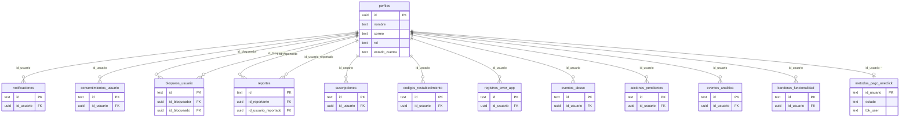

# Fase 2 — Modelo entidad-relación

| Campo | Valor |
|-------|--------|
| Proyecto | MyWorksApp |
| Esquema | PostgreSQL `public` (Supabase) |
| Tablas | **32** |
| Convención | español + `snake_case` |
| Versión | **2.0** — 4 de octubre de 2026 |
| Fuente | migraciones del repo (rename ES + liquidaciones + Oneclick + normalización 20261004) |

Este archivo es el **modelo entidad-relación del título**. Cada caja es una tabla; se listan la **clave primaria (PK)** y las **claves foráneas (FK)**.

El dump `schema_remote_dump.sql` sigue en inglés (`profiles`, `workers`…). **No es el esquema vivo.** El vivo es el de las migraciones en español.

## Dónde está cada copia

| Copia | Ruta | Para qué |
|-------|------|----------|
| **Vista portable (HTML)** | [modelo_entidad_relacion.html](modelo_entidad_relacion.html) | Abrir en el navegador |
| **Título (esta)** | `MODELO_ENTIDAD_RELACION.md` | Memoria / Mermaid / catálogo PK-FK |
| **SQL de importación** | [modelo_entidad_relacion.sql](modelo_entidad_relacion.sql) | pgModeler, DBeaver, DataGrip |
| **DBML** | [modelo_entidad_relacion.dbml](modelo_entidad_relacion.dbml) | dbdiagram.io / `@dbml/cli` |
| Diccionario técnico | `docs/DICCIONARIO_BASE_DATOS.md` | Columnas, RLS y consumidores |

---

## Cómo se lee

- **PK:** identifica la fila.
- **FK:** columna que apunta a la PK de otra tabla (`tabla.columna`).
- **?** : FK opcional (puede ser nula).
- **~** : relación lógica (slug, o `text` que no puede referenciar `uuid`).
- Cardinalidad: `1:1`, `1:0..1`, `1:N`, `N:M`.

Hubs:

- `perfiles.id` — identidad de cuenta (`auth.users.id`).
- `trabajadores.id_usuario` — ficha profesional 1:1.
- `trabajos.id` — pedido y expediente.
- `pagos.id` — escrow (Webpay / Oneclick).

`perfiles.id` coincide con `auth.users.id` (Auth de Supabase, fuera de las 32 tablas `public`).

---

## Qué cambió respecto de la v1.6 (29 tablas)

| Tabla | Alta | Para qué |
|-------|------|----------|
| `trabajador_precios` | 20261004 | Precios por código, explotados desde `niveles_precio` |
| `trabajador_servicios_extra` | 20261004 | Extras desde `servicios_personalizados` |
| `metodos_pago_oneclick` | 20261002 | Tarjeta inscrita; `tbk_user` no sale al cliente |
| `liquidaciones` | 20260923 | Ya estaba en el SQL v1.6; faltaba en este Markdown |

Tipos alineados a la BD:

- `trabajadores.calificacion` → `numeric(4,2)`
- `trabajadores.tarifa_visita` y `pagos.monto` → `numeric(12,0)`
- `pagos`: `reembolso_solicitado_en`, `orden_detalle_oneclick`, `cobro_reclamado_en`
- `trabajos.id_servicio` es **nullable** (como en Postgres: `ON DELETE SET NULL`)
- `calificaciones.id_usuario` es **nullable**
- `cancelaciones_trabajo.id_trabajo` es **UNIQUE** (una cancelación por trabajo)
- `configuraciones_servicio.id_servicio` es **UNIQUE** (1:0..1 real)

---

## 1. Identidad — `perfiles` y satélites

```mermaid
erDiagram
  perfiles {
    uuid id PK
    text nombre
    text correo
    text rol
    text estado_cuenta
  }

  notificaciones {
    text id PK
    uuid id_usuario FK
  }

  consentimientos_usuario {
    text id PK
    uuid id_usuario FK
  }

  bloqueos_usuario {
    text id PK
    uuid id_bloqueador FK
    uuid id_bloqueado FK
  }

  reportes {
    text id PK
    uuid id_reportante FK
    uuid id_usuario_reportado FK
  }

  suscripciones {
    text id PK
    uuid id_usuario FK
  }

  codigos_restablecimiento {
    text id PK
    uuid id_usuario FK
  }

  registros_error_app {
    text id PK
    uuid id_usuario FK
  }

  eventos_abuso {
    text id PK
    uuid id_usuario FK
  }

  acciones_pendientes {
    text id PK
    uuid id_usuario FK
  }

  eventos_analitica {
    text id PK
    uuid id_usuario FK
  }

  banderas_funcionalidad {
    text id PK
    uuid id_usuario FK
  }

  metodos_pago_oneclick {
    text id_usuario PK
    text estado
    text tbk_user
  }

  perfiles ||--o{ notificaciones : "id_usuario"
  perfiles ||--o{ consentimientos_usuario : "id_usuario"
  perfiles ||--o{ bloqueos_usuario : "id_bloqueador"
  perfiles ||--o{ bloqueos_usuario : "id_bloqueado"
  perfiles ||--o{ reportes : "id_reportante"
  perfiles ||--o{ reportes : "id_usuario_reportado"
  perfiles ||--o{ suscripciones : "id_usuario"
  perfiles ||--o{ codigos_restablecimiento : "id_usuario"
  perfiles ||--o{ registros_error_app : "id_usuario"
  perfiles ||--o{ eventos_abuso : "id_usuario"
  perfiles ||--o{ acciones_pendientes : "id_usuario"
  perfiles ||--o{ eventos_analitica : "id_usuario"
  perfiles ||--o{ banderas_funcionalidad : "id_usuario"
  perfiles ||--o| metodos_pago_oneclick : "id_usuario ~"
```

`id_usuario` en `registros_error_app`, `eventos_analitica` y `banderas_funcionalidad` es **nullable**. `metodos_pago_oneclick.id_usuario` es `text` (PK = `auth.uid()`); no hay FK física a `perfiles.id` (`uuid`).

---

## 2. Catálogo y profesional

```mermaid
erDiagram
  perfiles {
    uuid id PK
  }

  trabajadores {
    uuid id_usuario PK_FK
    text profesion
    text categoria_servicio
    numeric calificacion
    jsonb niveles_precio
  }

  servicios {
    text id PK
    text nombre
    text categoria
  }

  trabajador_servicios {
    uuid id_trabajador PK_FK
    text categoria_servicio PK
  }

  trabajador_precios {
    text id_usuario PK
    text codigo PK
    numeric monto_clp
  }

  trabajador_servicios_extra {
    text id_usuario PK
    text id PK
    text titulo
    numeric monto_clp
  }

  portafolio_trabajador {
    text id PK
    uuid id_trabajador FK
  }

  impulsos {
    text id PK
    uuid id_trabajador FK
  }

  configuraciones_servicio {
    text id PK
    text id_servicio FK
  }

  perfiles ||--o| trabajadores : "id_usuario"
  trabajadores ||--o{ trabajador_servicios : "id_trabajador"
  servicios ||--o{ trabajador_servicios : "categoria_servicio ~"
  trabajadores ||--o{ trabajador_precios : "id_usuario ~"
  trabajadores ||--o{ trabajador_servicios_extra : "id_usuario ~"
  trabajadores ||--o{ portafolio_trabajador : "id_trabajador"
  trabajadores ||--o{ impulsos : "id_trabajador"
  servicios ||--o| configuraciones_servicio : "id_servicio"
```

`trabajador_servicios` no tiene `id` surrogate: PK `(id_trabajador, categoria_servicio)`. El cruce a `servicios` es por **slug** `categoria`, no por `servicios.id`.

`trabajador_precios` y `trabajador_servicios_extra` las llena el trigger `explotar_oferta_trabajador` al escribir el JSON en `trabajadores`. `id_usuario` es `text` → relación **lógica**.

`calificacion` la refresca el trigger `refrescar_calificacion_trabajador` desde `calificaciones`.

---

## 3. Pedido — `trabajos` y expediente

```mermaid
erDiagram
  perfiles {
    uuid id PK
  }

  trabajadores {
    uuid id_usuario PK_FK
  }

  servicios {
    text id PK
  }

  trabajos {
    text id PK
    uuid id_usuario FK
    uuid id_trabajador FK
    text id_servicio FK
    text id_cotizacion_seleccionada FK
  }

  mensajes {
    text id PK
    text id_trabajo FK
    uuid id_remitente FK
    uuid id_destinatario FK
  }

  fotos_trabajo {
    text id PK
    text id_trabajo FK
  }

  calificaciones {
    text id PK
    text id_trabajo FK
    uuid id_usuario FK
  }

  disputas {
    text id PK
    text id_trabajo FK
    uuid abierta_por FK
    uuid resuelta_por FK
  }

  cancelaciones_trabajo {
    text id PK
    text id_trabajo FK
    uuid cancelado_por FK
  }

  tickets_soporte {
    text id PK
    text id_trabajo FK
  }

  perfiles ||--o{ trabajos : "id_usuario"
  trabajadores ||--o{ trabajos : "id_trabajador"
  servicios ||--o{ trabajos : "id_servicio"
  trabajos ||--o{ mensajes : "id_trabajo"
  perfiles ||--o{ mensajes : "id_remitente"
  perfiles ||--o{ mensajes : "id_destinatario"
  trabajos ||--o{ fotos_trabajo : "id_trabajo"
  trabajos ||--o{ calificaciones : "id_trabajo"
  perfiles ||--o{ calificaciones : "id_usuario"
  trabajos ||--o{ disputas : "id_trabajo"
  perfiles ||--o{ disputas : "abierta_por"
  perfiles ||--o{ disputas : "resuelta_por"
  trabajos ||--o| cancelaciones_trabajo : "id_trabajo"
  perfiles ||--o{ cancelaciones_trabajo : "cancelado_por"
  trabajos ||--o{ tickets_soporte : "id_trabajo"
```

Opcionales: `trabajos.id_trabajador`, `trabajos.id_servicio`, `tickets_soporte.id_trabajo`, `disputas.resuelta_por`, `calificaciones.id_usuario`.

---

## 4. Cobro — escrow, extras y liquidación

```mermaid
erDiagram
  trabajos {
    text id PK
    text id_cotizacion_seleccionada FK
  }

  trabajadores {
    uuid id_usuario PK_FK
  }

  perfiles {
    uuid id PK
  }

  propuestas_cotizacion {
    text id PK
    text id_trabajo FK
    uuid id_trabajador FK
  }

  pagos {
    text id PK
    text id_trabajo FK
    text id_orden_cambio FK
    numeric monto
  }

  ordenes_cambio {
    text id PK
    text id_trabajo FK
    uuid id_trabajador FK
    text id_pago FK
  }

  liquidaciones {
    text id PK
    text id_pago FK
    text id_trabajo FK
    text id_trabajador
  }

  metodos_pago_oneclick {
    text id_usuario PK
    text id_trabajo_pendiente
  }

  trabajos ||--o{ propuestas_cotizacion : "id_trabajo"
  trabajadores ||--o{ propuestas_cotizacion : "id_trabajador"
  propuestas_cotizacion ||--o| trabajos : "id_cotizacion_seleccionada"
  trabajos ||--o{ pagos : "id_trabajo"
  trabajos ||--o{ ordenes_cambio : "id_trabajo"
  trabajadores ||--o{ ordenes_cambio : "id_trabajador"
  pagos ||--o| ordenes_cambio : "id_orden_cambio"
  ordenes_cambio ||--o| pagos : "id_pago"
  pagos ||--o| liquidaciones : "id_pago"
  trabajos ||--o{ liquidaciones : "id_trabajo"
  trabajadores ||--o{ liquidaciones : "id_trabajador ~"
  perfiles ||--o| metodos_pago_oneclick : "id_usuario ~"
```

Ciclos lógicos: `trabajos.id_cotizacion_seleccionada` → `propuestas_cotizacion.id`; `pagos.id_orden_cambio` ↔ `ordenes_cambio.id_pago` (ambos nullable).

Índice único parcial: un solo pago `principal` vivo (`pendiente` / `retenido` / `autorizado`) por trabajo.

`liquidaciones.id_pago` es único: un pago se liquida como máximo una vez. `id_trabajador` es `text` (sin FK).

---

## Catálogo PK / FK (32 tablas)

| Tabla | PK | FK | Apunta a | Null | Cardinalidad |
|-------|----|----|----------|------|----------------|
| perfiles | id | — | auth.users.id (fuera de `public`) | no | 1:1 con Auth |
| trabajadores | id_usuario | id_usuario | perfiles.id | no | 1:1 |
| servicios | id | — | — | — | catálogo raíz |
| trabajador_servicios | (id_trabajador, categoria_servicio) | id_trabajador | trabajadores.id_usuario | no | N:1 |
| trabajador_servicios | (id_trabajador, categoria_servicio) | categoria_servicio ~ | servicios.categoria | no | N:M lógica |
| trabajador_precios | (id_usuario, codigo) | id_usuario ~ | trabajadores.id_usuario | no | N:1 lógica (`text`/`uuid`) |
| trabajador_servicios_extra | (id_usuario, id) | id_usuario ~ | trabajadores.id_usuario | no | N:1 lógica (`text`/`uuid`) |
| portafolio_trabajador | id | id_trabajador | trabajadores.id_usuario | no | N:1 |
| impulsos | id | id_trabajador | trabajadores.id_usuario | no | N:1 |
| configuraciones_servicio | id | id_servicio | servicios.id | no | 1:0..1 (UNIQUE) |
| trabajos | id | id_usuario | perfiles.id | no | N:1 |
| trabajos | id | id_trabajador | trabajadores.id_usuario | sí | N:0..1 |
| trabajos | id | id_servicio | servicios.id | sí | N:0..1 |
| trabajos | id | id_cotizacion_seleccionada | propuestas_cotizacion.id | sí | N:0..1 |
| mensajes | id | id_trabajo | trabajos.id | no | N:1 |
| mensajes | id | id_remitente | perfiles.id | no | N:1 |
| mensajes | id | id_destinatario | perfiles.id | no | N:1 |
| fotos_trabajo | id | id_trabajo | trabajos.id | no | N:1 |
| calificaciones | id | id_trabajo | trabajos.id | no | N:1 |
| calificaciones | id | id_usuario | perfiles.id | sí | N:0..1 |
| disputas | id | id_trabajo | trabajos.id | no | N:1 |
| disputas | id | abierta_por | perfiles.id | no | N:1 |
| disputas | id | resuelta_por | perfiles.id | sí | N:0..1 |
| cancelaciones_trabajo | id | id_trabajo | trabajos.id | no | 1:0..1 (UNIQUE) |
| cancelaciones_trabajo | id | cancelado_por | perfiles.id | no | N:1 |
| tickets_soporte | id | id_trabajo | trabajos.id | sí | N:0..1 |
| propuestas_cotizacion | id | id_trabajo | trabajos.id | no | N:1 |
| propuestas_cotizacion | id | id_trabajador | trabajadores.id_usuario | no | N:1 |
| pagos | id | id_trabajo | trabajos.id | no | N:1 |
| pagos | id | id_orden_cambio | ordenes_cambio.id | sí | N:0..1 |
| ordenes_cambio | id | id_trabajo | trabajos.id | no | N:1 |
| ordenes_cambio | id | id_trabajador | trabajadores.id_usuario | no | N:1 |
| ordenes_cambio | id | id_pago | pagos.id | sí | N:0..1 |
| liquidaciones | id | id_pago | pagos.id | no | 1:0..1 (UNIQUE) |
| liquidaciones | id | id_trabajo | trabajos.id | no | N:1 |
| liquidaciones | id | id_trabajador ~ | trabajadores.id_usuario | sí | N:0..1 lógica (`text`/`uuid`) |
| metodos_pago_oneclick | id_usuario | id_usuario ~ | perfiles.id | no | 1:0..1 lógica (`text`/`uuid`) |
| notificaciones | id | id_usuario | perfiles.id | no | N:1 |
| consentimientos_usuario | id | id_usuario | perfiles.id | no | N:1 |
| bloqueos_usuario | id | id_bloqueador | perfiles.id | no | N:1 |
| bloqueos_usuario | id | id_bloqueado | perfiles.id | no | N:1 |
| reportes | id | id_reportante | perfiles.id | no | N:1 |
| reportes | id | id_usuario_reportado | perfiles.id | no | N:1 |
| suscripciones | id | id_usuario | perfiles.id | no | N:1 |
| codigos_restablecimiento | id | id_usuario | perfiles.id | no | N:1 |
| registros_error_app | id | id_usuario | perfiles.id | sí | N:0..1 |
| eventos_abuso | id | id_usuario | perfiles.id | no | N:1 |
| acciones_pendientes | id | id_usuario | perfiles.id | no | N:1 |
| eventos_analitica | id | id_usuario | perfiles.id | sí | N:0..1 |
| banderas_funcionalidad | id | id_usuario | perfiles.id | sí | N:0..1 |

---

## Inventario de las 32 tablas

| # | Tabla | Rol en el modelo |
|---|--------|------------------|
| 1 | perfiles | Identidad de app = Auth |
| 2 | trabajadores | Ficha profesional 1:1 |
| 3 | servicios | Catálogo de oficios |
| 4 | trabajos | Pedido / ciclo de vida |
| 5 | pagos | Escrow Webpay / Oneclick |
| 6 | liquidaciones | Comprobante de pago al profesional |
| 7 | metodos_pago_oneclick | Tarjeta inscrita (solo servidor) |
| 8 | mensajes | Chat por trabajo |
| 9 | disputas | Conflicto sobre un trabajo |
| 10 | notificaciones | Inbox por usuario |
| 11 | calificaciones | Puntaje 1–5 del trabajo |
| 12 | reportes | Denuncia entre usuarios |
| 13 | propuestas_cotizacion | Presupuesto (cotización abierta) |
| 14 | ordenes_cambio | Extra / cambio de alcance |
| 15 | fotos_trabajo | Evidencia del servicio |
| 16 | portafolio_trabajador | Galería del profesional |
| 17 | trabajador_servicios | N:M profesional ↔ categoría |
| 18 | trabajador_precios | Tarifas por código (4NF) |
| 19 | trabajador_servicios_extra | Extras tarifados (4NF) |
| 20 | cancelaciones_trabajo | Auditoría de cancelación |
| 21 | registros_error_app | Telemetría de errores |
| 22 | eventos_abuso | Antiabuso |
| 23 | acciones_pendientes | Cola sync offline |
| 24 | bloqueos_usuario | Bloqueo interpersonal |
| 25 | consentimientos_usuario | GDPR / términos |
| 26 | banderas_funcionalidad | Feature flags |
| 27 | suscripciones | Planes |
| 28 | impulsos | Boost de visibilidad |
| 29 | eventos_analitica | Analytics de producto |
| 30 | configuraciones_servicio | Schema UI por oficio |
| 31 | codigos_restablecimiento | Reset de clave (app) |
| 32 | tickets_soporte | Mesa de ayuda |

---

## Notas de fidelidad física

1. **Dump vs. migraciones.** El dump remoto nombra `profiles` / `workers` / `jobs`. Las apps y este modelo usan los nombres ES de `20260914000004_aplicar_rename_es.sql`.
2. **FK de trabajador al dump.** `jobs.workerId`, `boosts.workerId`, `worker_portfolio.workerId`, `quote_proposals.workerId` apuntaban a `profiles.id`. El negocio (y este SQL) las modela contra `trabajadores.id_usuario`.
3. **`text` que no puede ser FK `uuid`:** `liquidaciones.id_trabajador`, `trabajador_precios.id_usuario`, `trabajador_servicios_extra.id_usuario`, `metodos_pago_oneclick.id_usuario`. El trigger `fijar_liquidacion_desde_pago` copia el id desde `trabajos`; `explotar_oferta_trabajador` escribe `id_usuario::text`.
4. **Triggers que el diagrama no dibuja pero sostienen el modelo:** `handle_new_user` (alta de `perfiles`), `explotar_oferta_trabajador`, `refrescar_calificacion_trabajador`, `copiar_estado_pago_trabajo`, `fijar_liquidacion_desde_pago`, `fijar_correo_codigo`, `fijar_ticket_desde_trabajo`.
5. **Columnas secretas.** `pagos.token_tbk`, `pagos.url_tbk` y `metodos_pago_oneclick.tbk_user` no se leen desde el cliente (REVOKE / solo `service_role`).
