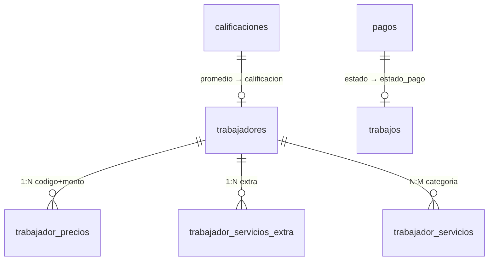

# Fase 2 — Modelo entidad-relación

| Campo | Valor |
|-------|--------|
| Proyecto | MyWorksApp |
| Esquema | PostgreSQL `public` (Supabase) |
| Tablas | **41** |
| Convención | español + `snake_case` |
| Versión | **2.3** — 5 de octubre de 2026 |
| Forma | **4NF** en oferta; catálogo **país → región → comuna**; copias derivadas |
| Fuente | migraciones ES + ranking `20261010000001` |

Este archivo es el **modelo entidad-relación del título**, en la **misma forma normal que la base**:

- La oferta del profesional **no** se consulta como JSON. Vive en `trabajador_precios` y `trabajador_servicios_extra` (4NF).
- `calificacion` y `estado_pago` son **copias** que rellenan triggers; la fuente son `calificaciones` y `pagos`.
- El JSON `niveles_precio` / `servicios_personalizados` queda en `trabajadores` solo como formato de **escritura** de la app.
- `trabajos.id_comuna` y `trabajadores.id_comuna` apuntan a **`comunas`**, no a un texto suelto. País y región son tablas padre.

El dump `schema_remote_dump.sql` sigue en inglés (`profiles`, `workers`…). **No es el esquema vivo.**

---

## Forma normal (migración 20261004)

| Dependencia | Antes | Ahora (como la BD) |
|-------------|-------|---------------------|
| Precio por código de tarifa | objeto JSON `niveles_precio` | `trabajador_precios` PK `(id_usuario, codigo)` |
| Extra tarifado | arreglo JSON `servicios_personalizados` | `trabajador_servicios_extra` PK `(id_usuario, id)` |
| Oficio del profesional | solo `categoria_servicio` en la ficha | también `trabajador_servicios` (N:M por slug) |
| Nota pública | columna suelta | promedio de `calificaciones` (trigger) |
| Estado de cobro del trabajo | columna suelta | copia del pago `principal` (trigger) |
| Un escrow vivo | varias filas posibles | índice único parcial en `pagos` |

```mermaid
erDiagram
  trabajadores ||--o{ trabajador_precios : "1:N  codigo+monto"
  trabajadores ||--o{ trabajador_servicios_extra : "1:N  extra"
  trabajadores ||--o{ trabajador_servicios : "N:M  categoria"
  calificaciones ||--o| trabajadores : "promedio → calificacion"
  pagos ||--o| trabajos : "estado → estado_pago"
```

JSON de escritura (no se dibuja como entidad de consulta): `trabajadores.niveles_precio`, `trabajadores.servicios_personalizados`.

---

## Dónde está cada copia

| Copia | Ruta | Para qué |
|-------|------|----------|
| **Vista portable (HTML)** | [modelo_entidad_relacion.html](modelo_entidad_relacion.html) | Abrir en el navegador |
| **Título (esta)** | `MODELO_ENTIDAD_RELACION.md` | Memoria / Mermaid / catálogo PK-FK |
| **SQL de importación** | [modelo_entidad_relacion.sql](modelo_entidad_relacion.sql) | pgModeler, DBeaver, DataGrip |
| **DBML** | [modelo_entidad_relacion.dbml](modelo_entidad_relacion.dbml) | dbdiagram.io / `@dbml/cli` |
| **Auditoría de IDs** | [AUDITORIA_IDS_Y_GEOGRAFIA.md](AUDITORIA_IDS_Y_GEOGRAFIA.md) | PK/FK, comuna, pendientes |

---

## Cómo se lee

- **PK:** identifica la fila.
- **FK:** columna que apunta a la PK de otra tabla (`tabla.columna`).
- **?** : FK opcional (puede ser nula).
- **~** : relación lógica (slug, o `text` que no puede referenciar `uuid`).
- Cardinalidad: `1:1`, `1:0..1`, `1:N`, `N:M`.

Hubs:

- `perfiles.id` — identidad de cuenta (`auth.users.id`).
- `trabajadores.id_usuario` — ficha profesional 1:1.
- `trabajos.id` — pedido y expediente.
- `pagos.id` — escrow (Webpay / Oneclick).

`perfiles.id` coincide con `auth.users.id` (Auth de Supabase, fuera de las 41 tablas `public`).

---

## Qué cambió en v2.3

Ranking de marketplace y confianza de reseñas (`20261010000001_ranking_y_resenas.sql`).

| Pieza | Tratamiento |
|-------|-------------|
| `trabajadores.score_listado` / `prioridad_manual` | Orden del catálogo. La nota pública no se edita |
| `ranking_config` | Pesos configurables + umbrales + `pesos_senal` |
| `eventos_ranking` / `ranking_aprendizaje` | Aprendizaje auditado por cierres vs disputas |
| `senales_resena` | Cola de reseñas dudosas; falso positivo baja el peso de la señal |
| `calificaciones.peso_confianza` / `estado_revision` | vigente / en_revision / excluida |

---

## Qué cambió en v2.2

Catálogo geográfico y FKs de localización. `id_comuna` deja de ser un slug huérfano.

| Pieza | Tratamiento |
|-------|-------------|
| `paises` / `regiones` / `comunas` | Tablas 3NF. Seed Chile + comunas de la app |
| `trabajos.id_comuna` | FK → `comunas.id` |
| `trabajadores.id_comuna` / `id_region` | FK; `zona_trabajo` queda como texto de UI |
| `ubicacion_en_vivo`, `app_config` | Ya existían en migraciones; ahora están en el ER |

---

## Qué cambió en v2.1

El modelo deja de tratar el JSON como la oferta. La forma de consulta es 4NF, igual que la BD tras `normalizar_y_optimizar`.

| Pieza | Tratamiento en este ER |
|-------|------------------------|
| `trabajador_precios` / `trabajador_servicios_extra` | Entidades 4NF con FK a `trabajadores` |
| `niveles_precio` / `servicios_personalizados` | Escritura física; no son caja del diagrama lógico |
| `calificacion` | Atributo derivado |
| `trabajos.estado_pago` | Atributo derivado |
| `metodos_pago_oneclick`, `liquidaciones` | Siguen (Oneclick 20261002, liquidaciones 20260923) |

---

## 1b. Territorio — país, región, comuna

`id_comuna` era un slug suelto (`providencia`, `puerto_montt`). Ahora es FK.

```mermaid
erDiagram
  paises {
    text id PK
    text nombre
    text iso2
  }

  regiones {
    text id PK
    text id_pais FK
    text nombre
  }

  comunas {
    text id PK
    text id_region FK
    text nombre
  }

  trabajadores {
    uuid id_usuario PK_FK
    text id_comuna FK
    text id_region FK
    text zona_trabajo
  }

  trabajos {
    text id PK
    text id_comuna FK
  }

  paises ||--o{ regiones : "id_pais"
  regiones ||--o{ comunas : "id_region"
  comunas ||--o{ trabajadores : "id_comuna"
  regiones ||--o{ trabajadores : "id_region"
  comunas ||--o{ trabajos : "id_comuna"
```

`zona_trabajo` sigue como texto de pantalla. El trigger `fijar_geo_trabajador` rellena `id_comuna` / `id_region`. Cobertura “(todas)” no es comuna: solo `id_region`.

Hoy el seed es Chile (`CL`) y las comunas/ciudades que usa la app (`ChileComunas` + slugs de `inferComunaKey`).

---

## 1. Identidad — `perfiles` y satélites

```mermaid
erDiagram
  perfiles {
    uuid id PK
    text nombre
    text correo
    text rol
    text estado_cuenta
  }

  notificaciones {
    text id PK
    uuid id_usuario FK
  }

  consentimientos_usuario {
    text id PK
    uuid id_usuario FK
  }

  bloqueos_usuario {
    text id PK
    uuid id_bloqueador FK
    uuid id_bloqueado FK
  }

  reportes {
    text id PK
    uuid id_reportante FK
    uuid id_usuario_reportado FK
  }

  suscripciones {
    text id PK
    uuid id_usuario FK
  }

  codigos_restablecimiento {
    text id PK
    uuid id_usuario FK
  }

  registros_error_app {
    text id PK
    uuid id_usuario FK
  }

  eventos_abuso {
    text id PK
    uuid id_usuario FK
  }

  acciones_pendientes {
    text id PK
    uuid id_usuario FK
  }

  eventos_analitica {
    text id PK
    uuid id_usuario FK
  }

  banderas_funcionalidad {
    text id PK
    uuid id_usuario FK
  }

  metodos_pago_oneclick {
    text id_usuario PK
    text estado
    text tbk_user
  }

  perfiles ||--o{ notificaciones : "id_usuario"
  perfiles ||--o{ consentimientos_usuario : "id_usuario"
  perfiles ||--o{ bloqueos_usuario : "id_bloqueador"
  perfiles ||--o{ bloqueos_usuario : "id_bloqueado"
  perfiles ||--o{ reportes : "id_reportante"
  perfiles ||--o{ reportes : "id_usuario_reportado"
  perfiles ||--o{ suscripciones : "id_usuario"
  perfiles ||--o{ codigos_restablecimiento : "id_usuario"
  perfiles ||--o{ registros_error_app : "id_usuario"
  perfiles ||--o{ eventos_abuso : "id_usuario"
  perfiles ||--o{ acciones_pendientes : "id_usuario"
  perfiles ||--o{ eventos_analitica : "id_usuario"
  perfiles ||--o{ banderas_funcionalidad : "id_usuario"
  perfiles ||--o| metodos_pago_oneclick : "id_usuario ~"
```

`id_usuario` en `registros_error_app`, `eventos_analitica` y `banderas_funcionalidad` es **nullable**. `metodos_pago_oneclick.id_usuario` es `text` (PK = `auth.uid()`); no hay FK física a `perfiles.id` (`uuid`).

---

## 2. Catálogo y profesional (4NF)

```mermaid
erDiagram
  perfiles {
    uuid id PK
  }

  trabajadores {
    uuid id_usuario PK_FK
    text profesion
    text categoria_servicio
    numeric calificacion_derivada
  }

  servicios {
    text id PK
    text nombre
    text categoria
  }

  trabajador_servicios {
    uuid id_trabajador PK_FK
    text categoria_servicio PK
  }

  trabajador_precios {
    uuid id_usuario PK_FK
    text codigo PK
    numeric monto_clp
  }

  trabajador_servicios_extra {
    uuid id_usuario PK_FK
    text id PK
    text titulo
    numeric monto_clp
    text unidad
  }

  portafolio_trabajador {
    text id PK
    uuid id_trabajador FK
  }

  impulsos {
    text id PK
    uuid id_trabajador FK
  }

  configuraciones_servicio {
    text id PK
    text id_servicio FK
  }

  perfiles ||--o| trabajadores : "id_usuario"
  trabajadores ||--o{ trabajador_servicios : "id_trabajador"
  servicios ||--o{ trabajador_servicios : "categoria_servicio ~"
  trabajadores ||--o{ trabajador_precios : "id_usuario"
  trabajadores ||--o{ trabajador_servicios_extra : "id_usuario"
  trabajadores ||--o{ portafolio_trabajador : "id_trabajador"
  trabajadores ||--o{ impulsos : "id_trabajador"
  servicios ||--o| configuraciones_servicio : "id_servicio"
```

`trabajador_servicios` no tiene `id` surrogate: PK `(id_trabajador, categoria_servicio)`. El cruce a `servicios` es por **slug** `categoria`, no por `servicios.id`.

`trabajador_precios` y `trabajador_servicios_extra` son la **forma 4NF**. El trigger `explotar_oferta_trabajador` las llena al escribir el JSON. En el SQL de modelado la FK es `uuid`; en Postgres vivo la columna es `text` (mismo valor, `::text`).

`calificacion` no se edita: la refresca `refrescar_calificacion_trabajador` desde `calificaciones`.

---

## 3. Pedido — `trabajos` y expediente

```mermaid
erDiagram
  perfiles {
    uuid id PK
  }

  trabajadores {
    uuid id_usuario PK_FK
  }

  servicios {
    text id PK
  }

  trabajos {
    text id PK
    uuid id_usuario FK
    uuid id_trabajador FK
    text id_servicio FK
    text id_cotizacion_seleccionada FK
    text estado_pago_derivado
  }

  mensajes {
    text id PK
    text id_trabajo FK
    uuid id_remitente FK
    uuid id_destinatario FK
  }

  fotos_trabajo {
    text id PK
    text id_trabajo FK
  }

  calificaciones {
    text id PK
    text id_trabajo FK
    uuid id_usuario FK
  }

  disputas {
    text id PK
    text id_trabajo FK
    uuid abierta_por FK
    uuid resuelta_por FK
  }

  cancelaciones_trabajo {
    text id PK
    text id_trabajo FK
    uuid cancelado_por FK
  }

  tickets_soporte {
    text id PK
    text id_trabajo FK
  }

  perfiles ||--o{ trabajos : "id_usuario"
  trabajadores ||--o{ trabajos : "id_trabajador"
  servicios ||--o{ trabajos : "id_servicio"
  trabajos ||--o{ mensajes : "id_trabajo"
  perfiles ||--o{ mensajes : "id_remitente"
  perfiles ||--o{ mensajes : "id_destinatario"
  trabajos ||--o{ fotos_trabajo : "id_trabajo"
  trabajos ||--o{ calificaciones : "id_trabajo"
  perfiles ||--o{ calificaciones : "id_usuario"
  trabajos ||--o{ disputas : "id_trabajo"
  perfiles ||--o{ disputas : "abierta_por"
  perfiles ||--o{ disputas : "resuelta_por"
  trabajos ||--o| cancelaciones_trabajo : "id_trabajo"
  perfiles ||--o{ cancelaciones_trabajo : "cancelado_por"
  trabajos ||--o{ tickets_soporte : "id_trabajo"
```

Opcionales: `trabajos.id_trabajador`, `trabajos.id_servicio`, `tickets_soporte.id_trabajo`, `disputas.resuelta_por`, `calificaciones.id_usuario`.

`trabajos.estado_pago` es copia del pago `principal` (`copiar_estado_pago_trabajo`). La fuente es `pagos.estado`.

---

## 4. Cobro — escrow, extras y liquidación

```mermaid
erDiagram
  trabajos {
    text id PK
    text id_cotizacion_seleccionada FK
  }

  trabajadores {
    uuid id_usuario PK_FK
  }

  perfiles {
    uuid id PK
  }

  propuestas_cotizacion {
    text id PK
    text id_trabajo FK
    uuid id_trabajador FK
  }

  pagos {
    text id PK
    text id_trabajo FK
    text id_orden_cambio FK
    numeric monto
  }

  ordenes_cambio {
    text id PK
    text id_trabajo FK
    uuid id_trabajador FK
    text id_pago FK
  }

  liquidaciones {
    text id PK
    text id_pago FK
    text id_trabajo FK
    text id_trabajador
  }

  metodos_pago_oneclick {
    text id_usuario PK
    text id_trabajo_pendiente
  }

  trabajos ||--o{ propuestas_cotizacion : "id_trabajo"
  trabajadores ||--o{ propuestas_cotizacion : "id_trabajador"
  propuestas_cotizacion ||--o| trabajos : "id_cotizacion_seleccionada"
  trabajos ||--o{ pagos : "id_trabajo"
  trabajos ||--o{ ordenes_cambio : "id_trabajo"
  trabajadores ||--o{ ordenes_cambio : "id_trabajador"
  pagos ||--o| ordenes_cambio : "id_orden_cambio"
  ordenes_cambio ||--o| pagos : "id_pago"
  pagos ||--o| liquidaciones : "id_pago"
  trabajos ||--o{ liquidaciones : "id_trabajo"
  trabajadores ||--o{ liquidaciones : "id_trabajador ~"
  perfiles ||--o| metodos_pago_oneclick : "id_usuario ~"
```

Ciclos lógicos: `trabajos.id_cotizacion_seleccionada` → `propuestas_cotizacion.id`; `pagos.id_orden_cambio` ↔ `ordenes_cambio.id_pago` (ambos nullable).

Índice único parcial: un solo pago `principal` vivo (`pendiente` / `retenido` / `autorizado`) por trabajo.

`liquidaciones.id_pago` es único: un pago se liquida como máximo una vez. `id_trabajador` es `text` (sin FK).

---

## Catálogo PK / FK (41 tablas)

| Tabla | PK | FK | Apunta a | Null | Cardinalidad |
|-------|----|----|----------|------|----------------|
| perfiles | id | — | auth.users.id (fuera de `public`) | no | 1:1 con Auth |
| paises | id | — | — | — | catálogo raíz |
| regiones | id | id_pais | paises.id | no | N:1 |
| comunas | id | id_region | regiones.id | no | N:1 |
| trabajadores | id_usuario | id_usuario | perfiles.id | no | 1:1 |
| trabajadores | id_usuario | id_comuna | comunas.id | sí | N:0..1 |
| trabajadores | id_usuario | id_region | regiones.id | sí | N:0..1 |
| servicios | id | — | — | — | catálogo raíz |
| trabajador_servicios | (id_trabajador, categoria_servicio) | id_trabajador | trabajadores.id_usuario | no | N:1 |
| trabajador_servicios | (id_trabajador, categoria_servicio) | categoria_servicio ~ | servicios.categoria | no | N:M lógica |
| trabajador_precios | (id_usuario, codigo) | id_usuario | trabajadores.id_usuario | no | N:1 (4NF) |
| trabajador_servicios_extra | (id_usuario, id) | id_usuario | trabajadores.id_usuario | no | N:1 (4NF) |
| portafolio_trabajador | id | id_trabajador | trabajadores.id_usuario | no | N:1 |
| impulsos | id | id_trabajador | trabajadores.id_usuario | no | N:1 |
| configuraciones_servicio | id | id_servicio | servicios.id | no | 1:0..1 (UNIQUE) |
| trabajos | id | id_usuario | perfiles.id | no | N:1 |
| trabajos | id | id_trabajador | trabajadores.id_usuario | sí | N:0..1 |
| trabajos | id | id_servicio | servicios.id | sí | N:0..1 |
| trabajos | id | id_comuna | comunas.id | sí | N:0..1 |
| trabajos | id | id_cotizacion_seleccionada | propuestas_cotizacion.id | sí | N:0..1 |
| mensajes | id | id_trabajo | trabajos.id | no | N:1 |
| mensajes | id | id_remitente | perfiles.id | no | N:1 |
| mensajes | id | id_destinatario | perfiles.id | no | N:1 |
| fotos_trabajo | id | id_trabajo | trabajos.id | no | N:1 |
| calificaciones | id | id_trabajo | trabajos.id | no | N:1 |
| calificaciones | id | id_usuario | perfiles.id | sí | N:0..1 |
| disputas | id | id_trabajo | trabajos.id | no | N:1 |
| disputas | id | abierta_por | perfiles.id | no | N:1 |
| disputas | id | resuelta_por | perfiles.id | sí | N:0..1 |
| cancelaciones_trabajo | id | id_trabajo | trabajos.id | no | 1:0..1 (UNIQUE) |
| cancelaciones_trabajo | id | cancelado_por | perfiles.id | no | N:1 |
| tickets_soporte | id | id_trabajo | trabajos.id | sí | N:0..1 |
| propuestas_cotizacion | id | id_trabajo | trabajos.id | no | N:1 |
| propuestas_cotizacion | id | id_trabajador | trabajadores.id_usuario | no | N:1 |
| pagos | id | id_trabajo | trabajos.id | no | N:1 |
| pagos | id | id_orden_cambio | ordenes_cambio.id | sí | N:0..1 |
| ordenes_cambio | id | id_trabajo | trabajos.id | no | N:1 |
| ordenes_cambio | id | id_trabajador | trabajadores.id_usuario | no | N:1 |
| ordenes_cambio | id | id_pago | pagos.id | sí | N:0..1 |
| liquidaciones | id | id_pago | pagos.id | no | 1:0..1 (UNIQUE) |
| liquidaciones | id | id_trabajo | trabajos.id | no | N:1 |
| liquidaciones | id | id_trabajador ~ | trabajadores.id_usuario | sí | N:0..1 lógica (`text`/`uuid`) |
| metodos_pago_oneclick | id_usuario | id_usuario ~ | perfiles.id | no | 1:0..1 lógica (`text`/`uuid`) |
| notificaciones | id | id_usuario | perfiles.id | no | N:1 |
| consentimientos_usuario | id | id_usuario | perfiles.id | no | N:1 |
| bloqueos_usuario | id | id_bloqueador | perfiles.id | no | N:1 |
| bloqueos_usuario | id | id_bloqueado | perfiles.id | no | N:1 |
| reportes | id | id_reportante | perfiles.id | no | N:1 |
| reportes | id | id_usuario_reportado | perfiles.id | no | N:1 |
| suscripciones | id | id_usuario | perfiles.id | no | N:1 |
| codigos_restablecimiento | id | id_usuario | perfiles.id | no | N:1 |
| registros_error_app | id | id_usuario | perfiles.id | sí | N:0..1 |
| eventos_abuso | id | id_usuario | perfiles.id | no | N:1 |
| acciones_pendientes | id | id_usuario | perfiles.id | no | N:1 |
| eventos_analitica | id | id_usuario | perfiles.id | sí | N:0..1 |
| banderas_funcionalidad | id | id_usuario | perfiles.id | sí | N:0..1 |
| ubicacion_en_vivo | id_trabajo | id_trabajo | trabajos.id | no | 1:1 |
| ubicacion_en_vivo | id_trabajo | id_trabajador | trabajadores.id_usuario | no | N:1 |
| app_config | clave | — | — | — | catálogo de producto |
| ranking_config | id | — | — | — | singleton `default` |
| senales_resena | id | id_calificacion | calificaciones.id | no | N:1 CASCADE |
| senales_resena | id | resuelto_por | perfiles.id | sí | N:0..1 |
| ranking_aprendizaje | id | — | — | — | historial de pesos |
| eventos_ranking | id | id_trabajador ~ | trabajadores.id_usuario | no | N:1 lógica (SQL sin FK) |
| eventos_ranking | id | id_trabajo ~ | trabajos.id | sí | N:0..1 lógica (`text`, sin FK) |

---

## Inventario de las 41 tablas

| # | Tabla | Rol en el modelo |
|---|--------|------------------|
| 1 | perfiles | Identidad de app = Auth |
| 2 | paises | País (CL) |
| 3 | regiones | Región administrativa |
| 4 | comunas | Comuna / ciudad de cobertura |
| 5 | trabajadores | Ficha 1:1; JSON solo escritura |
| 6 | servicios | Catálogo de oficios |
| 7 | trabajos | Pedido / ciclo de vida |
| 8 | pagos | Escrow Webpay / Oneclick |
| 9 | liquidaciones | Comprobante de pago al profesional |
| 10 | metodos_pago_oneclick | Tarjeta inscrita (solo servidor) |
| 11 | mensajes | Chat por trabajo |
| 12 | disputas | Conflicto sobre un trabajo |
| 13 | notificaciones | Inbox por usuario |
| 14 | calificaciones | Fuente de la nota (1–5) |
| 15 | reportes | Denuncia entre usuarios |
| 16 | propuestas_cotizacion | Presupuesto (cotización abierta) |
| 17 | ordenes_cambio | Extra / cambio de alcance |
| 18 | fotos_trabajo | Evidencia del servicio |
| 19 | portafolio_trabajador | Galería del profesional |
| 20 | trabajador_servicios | N:M profesional ↔ categoría |
| 21 | trabajador_precios | **4NF** tarifas por código |
| 22 | trabajador_servicios_extra | **4NF** extras tarifados |
| 23 | cancelaciones_trabajo | Auditoría de cancelación |
| 24 | registros_error_app | Telemetría de errores |
| 25 | eventos_abuso | Antiabuso |
| 26 | acciones_pendientes | Cola sync offline |
| 27 | bloqueos_usuario | Bloqueo interpersonal |
| 28 | consentimientos_usuario | GDPR / términos |
| 29 | banderas_funcionalidad | Feature flags |
| 30 | suscripciones | Planes |
| 31 | impulsos | Boost de visibilidad |
| 32 | eventos_analitica | Analytics de producto |
| 33 | configuraciones_servicio | Schema UI por oficio |
| 34 | codigos_restablecimiento | Reset de clave (app) |
| 35 | tickets_soporte | Mesa de ayuda |
| 36 | ubicacion_en_vivo | GPS del pedido (1:1) |
| 37 | app_config | Interruptores de producto |
| 38 | ranking_config | Pesos y umbrales del listado |
| 39 | senales_resena | Señales de reseña dudosa |
| 40 | ranking_aprendizaje | Historial de pesos aprendidos |
| 41 | eventos_ranking | Cierres / disputas para el aprendizaje |

---

## Notas de fidelidad física

1. **Dump vs. migraciones.** El dump remoto nombra `profiles` / `workers` / `jobs`. Las apps y este modelo usan los nombres ES.
2. **JSON vs. 4NF.** En Postgres siguen `niveles_precio` y `servicios_personalizados`. El ER de título consulta `trabajador_precios` y `trabajador_servicios_extra`. El trigger `explotar_oferta_trabajador` mantiene ambas formas.
3. **Tipo `text` vs. `uuid` en la oferta.** El SQL de modelado usa `uuid` + FK (forma 4NF). La BD viva guarda `id_usuario text` (`::text` en el trigger). El valor es el mismo.
4. **Siguen en `text` sin FK uuid:** `liquidaciones.id_trabajador`, `metodos_pago_oneclick.id_usuario`. `eventos_ranking.id_trabajo` es `text` sin FK; `id_trabajador` es `uuid` sin FK declarada (el ER las modela lógicamente).
5. **FK de trabajador en el dump inglés** apuntaban a `profiles.id`. El negocio las modela contra `trabajadores.id_usuario`.
6. **Triggers:** `handle_new_user`, `explotar_oferta_trabajador`, `refrescar_calificacion_trabajador`, `copiar_estado_pago_trabajo`, `fijar_liquidacion_desde_pago`, `fijar_correo_codigo`, `fijar_ticket_desde_trabajo`, `calificaciones_evaluar_resena`, `trabajos_eventos_ranking`, `disputas_eventos_ranking`, `impulsos_refrescar_ranking`, `trabajadores_refrescar_ranking`.
7. **Columnas secretas.** `pagos.token_tbk`, `pagos.url_tbk` y `metodos_pago_oneclick.tbk_user` no salen al cliente.
