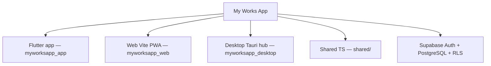

# My Works App — Ecosistema multiplataforma (MVP)

[]()
[]()
[]()

Marketplace de servicios del hogar (cliente + profesional) para Chile, con hub web y escritorio admin.  
**Estado:** listo para lanzar comercial con Webpay en integración; flip a producción al crear la empresa (ver runbook Transbank).

Documento técnico de referencia: [`ESTADO_DEL_PROYECTO.md`](ESTADO_DEL_PROYECTO.md).  
Diccionario de datos: [`docs/DICCIONARIO_BASE_DATOS.md`](docs/DICCIONARIO_BASE_DATOS.md).  
Pruebas de capacidad (k6): [`docs/RUNBOOK_CAPACIDAD_CARGA.md`](docs/RUNBOOK_CAPACIDAD_CARGA.md).  
Escala ≥20.000 usuarios: [`docs/RUNBOOK_ESCALA_20K_USUARIOS.md`](docs/RUNBOOK_ESCALA_20K_USUARIOS.md).  
Informe Word (Duoc UC): [`docs/INFORME_PRUEBAS_CARGA_CAPACIDAD.docx`](docs/INFORME_PRUEBAS_CARGA_CAPACIDAD.docx).

---

## Arquitectura de software

### En una frase

> **Monorepo multiplataforma** con arquitectura **cliente–servidor** sobre **Supabase (BaaS)**: tres clientes (móvil, web, escritorio) comparten un backend (Auth + PostgreSQL + RLS + Edge Functions). En la app Flutter se usa un enfoque **modular por features** con capas prácticas (UI → servicios → repositorios), inspirado en Clean Architecture sin aplicarla de forma rígida.

### Qué tipo de arquitectura es

| Nombre que usamos | Qué significa en la práctica |
|-------------------|------------------------------|
| **Cliente–servidor** | Los datos viven en la nube (Supabase). Las apps no son “solo offline”. |
| **BaaS (Backend as a Service)** | No inventamos un API desde cero: Auth, Postgres, RLS y Edge Functions. |
| **Monorepo** | Un solo repositorio con app, web, desktop y `shared/`. |
| **Modular / Feature-First (Flutter)** | Pantallas agrupadas por funcionalidad (`features/`), con un `core/` compartido. |
| **Capas pragmáticas** | Presentación → servicios de aplicación → dominio → repositorios → Supabase. |
| **Serverless en el borde** | Pagos Webpay y guest-checkout corren en **Edge Functions** (Deno), no en el celular. |

### Diagrama del ecosistema

```text
┌─────────────────┐   ┌─────────────────┐   ┌──────────────────────┐
│  App Flutter    │   │  Web (Vite)     │   │  Desktop (Tauri)     │
│  Cliente /      │   │  Landing +      │   │  Admin / soporte     │
│  profesional    │   │  checkout       │   │                      │
└────────┬────────┘   └────────┬────────┘   └──────────┬───────────┘
         │                     │                         │
         └──────────┬──────────┴──────────┬──────────────┘
                    ▼                     ▼
            shared/ (TypeScript)    Supabase
                                    Auth + PostgreSQL + RLS
                    │                     │
                    └──────────┬──────────┘
                               ▼
                    Edge Functions (Webpay, guest-checkout)
                               ▼
                         Transbank (integración)
```

### Capas dentro de la app móvil (Flutter)

```text
features/*/presentation/   →  pantallas y widgets
core/services/             →  orquestación (trabajos, precios, estados)
core/domain/               →  reglas y constantes de negocio
core/database/repositories →  acceso a datos
                    ↓
              Supabase (Postgres + Auth)
```

Web y desktop reutilizan contratos TypeScript en `shared/` y hablan al mismo backend.

### Dinero (patrón de pagos)

1. El cliente paga en **Transbank Webpay**. My Works App **no** pide ni guarda el número de la tarjeta (en jerga bancaria: **PAN** = *Primary Account Number*, el número largo de la tarjeta).  
2. El commit deja el pago **`retenido`** (escrow de negocio: la plata queda “congelada” hasta liquidar al profesional).  
3. Un administrador registra la liquidación al profesional (`liquidaciones`, hoy transferencia manual).

Detalle: [`docs/DICCIONARIO_BASE_DATOS.md`](docs/DICCIONARIO_BASE_DATOS.md) y [`docs/RUNBOOK_TRANSBANK_PRODUCCION.md`](docs/RUNBOOK_TRANSBANK_PRODUCCION.md).

---

## Metodología de trabajo

### En una frase

> Trabajamos con **desarrollo ágil iterativo e incremental** orientado a un **MVP**, organizado por **fases Capstone (APT / Duoc UC)** y entregas pequeñas que se pueden demostrar, auditar y documentar.

### Qué metodología es (y qué no es)

| Sí aplicamos | Cómo se ve en el proyecto |
|--------------|---------------------------|
| **Ágil / iterativo-incremental** | Se entrega por ciclos: auth → trabajos → RLS → Webpay → liquidación → hardening. |
| **MVP primero** | Priorizamos lo demostrable y comercializable; lo demorado (MFA, payout automático) queda explícito como pendiente. |
| **Fases Capstone (APT)** | Fase 1 definición; Fase 2 y siguientes con evidencias académicas; el código vive en el monorepo. |
| **Trabajo por dominio** | Cada incremento toca un flujo (reserva, pago, admin) de punta a punta, no “páginas sueltas”. |
| **Calidad continua** | CI (analyze/test Flutter, lint/build web-desktop), runbooks, diccionario de BD, auditorías de seguridad. |

| No pretendemos ser | Por qué |
|--------------------|---------|
| Waterfall / cascada pura | El alcance del MVP se ajusta con feedback, no con un único diseño cerrado al inicio. |
| Scrum ceremonial estricto | No dependemos de ceremonias formales diarias documentadas; sí de sprints de entrega y priorización. |
| Clean Architecture dogmática | Las capas existen donde aportan velocidad y claridad; no hay use-cases formales en cada feature. |

### Ciclo típico de una iteración

```text
Priorizar un flujo (ej. Webpay guest)
    → Diseñar / acordar estados en BD
    → Implementar clientes + Edge + migración
    → Probar (local / integración Transbank)
    → Documentar (README, diccionario, runbook)
    → Commit + CI
```

---

## Estructura del monorepo



| Carpeta | Rol |
|---------|-----|
| `myworksapp_app/` | App principal Flutter (usuario, trabajador, admin) |
| `myworksapp_web/` | Landing / flujo cliente web |
| `myworksapp_desktop/` | Hub operativo admin (Tauri) |
| `shared/` | Auth y repositorios TypeScript compartidos (web/desktop) |
| `myworksapp_app/supabase/migrations/` | Migraciones SQL (esquema, RLS, Webpay, liquidaciones) |
| `docs/` | Diccionario BD, runbooks Transbank/payout, arquitectura de cobro |

---

## Qué es real vs demo

| Capacidad | Realidad |
|-----------|----------|
| Auth Supabase + perfiles / roles | Real |
| Jobs, matching, estado de trabajos (Flutter) | Real (con reglas de dominio) |
| Escrow / pagos | **Webpay Plus** (integración Transbank; flip a prod vía secrets) |
| GPS en vivo (web) | **Simulado** (animación UI) |
| Firma “SHA-256 / Ley 19.799” (desktop) | **Demo** (no es firma criptográfica legal) |
| DevSecOps “test runner 1-click” | **Demo UI** (no ejecuta suites reales) |
| CSAT 99.4% / GMV $14.85M | **Datos de ejemplo**, no métricas medidas |
| Stress tests 15k VUs | **No hay scripts** de carga en este repo |
| Tests automatizados | Flutter unit/widget; web/desktop sin suite aún |

---

## Ejecución local

### Variables de entorno

Copia los ejemplos y completa con tu proyecto Supabase:

```bash
cp myworksapp_web/.env.example myworksapp_web/.env
cp myworksapp_desktop/.env.example myworksapp_desktop/.env
```

Flutter (opcional, recomendado en CI):

```bash
flutter run --dart-define=SUPABASE_URL=https://xxx.supabase.co --dart-define=SUPABASE_ANON_KEY=sb_publishable_...
```

### Web

```bash
cd myworksapp_web
npm install
npm run dev -- --port 3000
```

### Desktop hub

```bash
cd myworksapp_desktop
npm install
npm run tauri:dev
```

### Flutter

```bash
cd myworksapp_app
flutter pub get
flutter test
flutter run
```

Cuentas demo **solo staging/debug** (nunca en release UI): ver `DEMO.md`. Runbook Webpay: [`docs/RUNBOOK_TRANSBANK_PRODUCCION.md`](docs/RUNBOOK_TRANSBANK_PRODUCCION.md).

---

## Calidad y CI

- Flutter: `flutter analyze` + `flutter test` (`.github/workflows/flutter_ci.yml`)
- Web/desktop: lint + build; Tauri build en Windows (`.github/workflows/web_desktop_ci.yml`)
- Gitleaks, Scorecard, commitlint y keepalive de Supabase (requiere secrets `SUPABASE_URL` / `SUPABASE_ANON_KEY`)
- **Capacidad / stress (manual):** [`docs/RUNBOOK_CAPACIDAD_CARGA.md`](docs/RUNBOOK_CAPACIDAD_CARGA.md) — scripts en `scripts/load/k6/`

Pre-commit local: ver `.pre-commit-config.yaml`.

---

## Licencia

Proyecto académico / demo. Todos los derechos reservados salvo acuerdo distinto.
