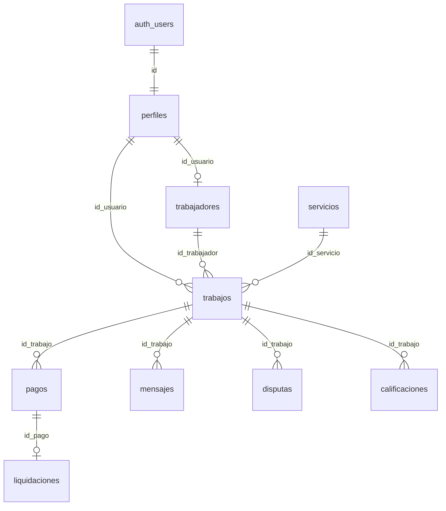

# Diccionario de base de datos — My Works App

| Campo | Valor |
|-------|--------|
| Proyecto | My Works App |
| Base | Supabase `wxqrfcqifkfgawrnqmnj` (PostgreSQL, esquema `public`) |
| Convención | Nombres en español, `snake_case` |
| Versión | **1.6** — 20 de septiembre de 2026 |
| Estado en el servidor | Rename ES, RLS, Webpay, liquidaciones y blindaje `token_tbk` **aplicados** |

---

## En una frase (para explicar el proyecto)

> La base guarda **quiénes son** las personas, **qué trabajo** pidieron y **qué pasó con el dinero**. El cobro real lo hace **Transbank**; nosotros guardamos el estado del escrow y, al final, la liquidación al profesional.

---

## Cómo se lee este documento

1. **Sección 1** — historia de un servicio (útil para defender el título).
2. **Sección 2** — índice de tablas (29).
3. **Sección 3** — textos exactos de estado (hay que copiarlos tal cual).
4. **Sección 4** — tablas del día a día, con columnas.
5. **Sección 5** — plata: Webpay → retenido → liquidación.
6. **Sección 6** — quién puede ver o cambiar cada cosa.
7. **Sección 7–9** — apps, pendientes y SQL.

Tipos mixtos: algunos `id` son `uuid` y otros `text`. Los sí/no suelen ser `1` / `0`. Las políticas comparan con `::text` para que eso no falle.

---

## 1. Historia de un servicio (el hilo conductor)

```text
1. La persona se registra     → auth.users + perfiles
2. Si ofrece oficio           → trabajadores
3. Elige un oficio del catálogo → servicios
4. Pide una visita            → trabajos (estado + estado_pago)
5. Paga con Webpay            → pagos (pendiente → retenido)
6. Se hace el trabajo         → trabajos (en_curso → completado)
7. Admin liquida al profesional → liquidaciones (+ pago liberado)
```

Diagrama del esqueleto (no dibuja las 29 tablas):



**Cómo explicar una flecha:** `trabajos ||--o{ pagos` = un trabajo puede tener varios pagos. `pagos ||--o| liquidaciones` = un pago se liquida como máximo una vez.

---

## 2. Las 29 tablas

| # | Tabla | En lenguaje simple |
|---|--------|-------------------|
| 1 | `perfiles` | Ficha de la persona (nombre, correo, rol) |
| 2 | `trabajadores` | Quien ofrece el oficio (tarifa, zona, nota) |
| 3 | `servicios` | Catálogo de oficios (plomería, electricidad…) |
| 4 | `trabajos` | La solicitud y su ciclo de vida |
| 5 | `pagos` | El cobro Webpay / escrow de negocio |
| 6 | **`liquidaciones`** | **Comprobante de pago al profesional (manual hoy)** |
| 7 | `mensajes` | Chat del trabajo |
| 8 | `disputas` | Conflicto entre las partes |
| 9 | `notificaciones` | Avisos en la app |
| 10 | `calificaciones` | Nota 1–5 |
| 11 | `reportes` | Denuncia entre usuarios |
| 12–17 | cotizaciones, órdenes de cambio, fotos, portafolio, oficios del trabajador, cancelaciones | Alcance, evidencia y cancelación |
| 18–29 | errores, abuso, sync offline, bloqueos, consentimientos, flags, suscripciones, impulsos, analítica, configs, reset password, tickets | Soporte, cumplimiento y funciones auxiliares |

Uso diario del título: **1–11**. El resto existe en el esquema y puede no usarse en la demo.

---

## 3. Textos exactos de estado

Hay que usarlos **tal cual**. Un valor inventado a veces entra en la base y el error aparece después en la app.

| Tema | Valores |
|------|---------|
| Rol | `usuario`, `trabajador`, `administrador` (`is_admin()` también acepta `admin`) |
| Cuenta | `activo`, `suspendido`, `bloqueado`, `eliminado` |
| Trabajo | `pendiente`, `aceptado`, `en_curso`, `completado`, `cancelado`, `expirado`, `no_asistio`, `esperando_pago`, `esperando_cotizaciones`, `cotizacion_seleccionada`, `pausado_orden_cambio`, `esperando_aprobacion_cliente` |
| Pago | `pendiente`, `autorizado`, `retenido`, `liberado`, `reembolsado` |
| Modalidad de cobro | `legado`, `precio_fijo`, `bloque_horas`, `cotizacion_abierta` |
| Tipo de pago | `principal`, `orden_cambio`, `horas_extra` |
| Ambiente Webpay | `integration`, `production` |
| Proveedor liquidación | `manual`, `khipu`, `fintoc` (hoy solo `manual` en producción de producto) |
| Disputa | Estado: `abierta`, `en_revision`, `resuelta` |
| Categoría oficio | `construccion`, `plomeria`, `electricidad`, `limpieza`, `ensamblaje`, `soporte_tecnico`, `jardinera`, `mudanza`, `general` |

### Qué significa el dinero (explicación corta)

| Estado del pago | Qué le dices a alguien no técnico |
|-----------------|-----------------------------------|
| `pendiente` | Se abrió la intención; el cliente aún no termina en Transbank |
| `retenido` | Transbank autorizó; el dinero queda **retenido** en escrow de negocio |
| `liberado` | Admin confirmó la transferencia al profesional |
| `reembolsado` | Se devolvió el cobro (Edge `webpay-refund`) |

`autorizado` puede aparecer en caminos legacy; el flujo Webpay actual deja el pago en **`retenido`** tras un commit exitoso.

---

## 4. Tablas principales

### 4.1 perfiles

**En una frase:** la ficha de quien inicia sesión.

| Columna | Qué es |
|---------|--------|
| `id` | Mismo id que `auth.users` |
| `nombre`, `correo` | Datos visibles |
| `rol` | `usuario` / `trabajador` / `administrador` |
| `estado_cuenta` | Si puede operar (`activo`, etc.) |
| `ruta_foto_perfil` | Foto (opcional) |
| `creado_en` | Alta |

Al registrarse, `handle_new_user` crea la ficha. Nadie se auto-asigna `administrador` en registro público.

### 4.2 trabajadores

**En una frase:** el perfil comercial del profesional.

Columnas clave: `id_usuario`, `profesion`, `descripcion`, `calificacion`, `disponible` (0/1), `tarifa_visita` (CLP), `categoria_servicio`, `zona_trabajo`, `niveles_precio` (JSON).

El catálogo público puede **leer** esta tabla sin sesión. No la puede modificar.

### 4.3 servicios

**En una frase:** los oficios que aparecen en el home.

Columnas clave: `id`, `nombre`, `categoria`, `activo` (0/1), `modelo_precio`, `requiere_certificacion`.

Si está vacía, la app no muestra oficios aunque existan profesionales.

### 4.4 trabajos

**En una frase:** la solicitud: quién pidió, a quién, qué oficio y en qué estado.

Columnas clave: `id`, `id_usuario` (cliente), `id_trabajador` (profesional, puede ir vacío), `id_servicio`, `estado`, `estado_pago`, `direccion`, `descripcion`, `modalidad_cobro`, `metadatos_servicio`, `instantanea_precio`, `creado_en`, `actualizado_en`.

El cliente **no** cambia `estado` con un `UPDATE` directo: usa la función `transicionar_trabajo`.

### 4.5 pagos

**En una frase:** el cobro Webpay ligado a un trabajo (escrow de negocio).

| Columna | Quién la ve | Qué es |
|---------|-------------|--------|
| `id`, `id_trabajo`, `monto`, `moneda` | Cliente / partes / admin | Identidad y monto (CLP) |
| `estado` | Igual | Ver sección 3 |
| `tipo_pago`, `metodo_pago` | Igual | p. ej. `principal`, `webpay` |
| `id_transaccion`, `buy_order` | Igual | Referencias de la pasarela |
| `ambiente` | Igual | `integration` o `production` |
| `autorizado_en`, `liberado_en`, `reembolsado_en` | Igual | Fechas del ciclo |
| **`token_tbk`**, **`url_tbk`** | **Solo Edge / service_role** | Token y URL de Transbank. **El cliente no puede leerlas** (REVOKE de columnas). |
| `handoff_consumido_en` | Sistema | Marca que el ticket de handoff ya se usó (un solo uso) |

**Regla de oro:** la app nunca captura datos de tarjeta. Transbank cobra; nosotros guardamos el resultado.

### 4.6 liquidaciones *(nueva en v1.6)*

**En una frase:** el registro de que el admin ya pagó al profesional (hoy: transferencia bancaria fuera de la app).

| Columna | Qué es |
|---------|--------|
| `id` | Identificador |
| `id_pago` | Pago liberado (único: un pago → una liquidación) |
| `id_trabajo`, `id_trabajador` | Contexto |
| `monto_clp` | Monto liquidado |
| `proveedor` | `manual` hoy; `khipu` / `fintoc` reservados |
| `referencia_transferencia` | Nº o código de la transferencia (≥ 4 caracteres) |
| `notas` | Opcional |
| `id_operador` | Admin que confirmó |
| `creado_en` | Cuándo se registró |

Solo administradores leen/escriben esta tabla (RLS + `is_admin()`).

### 4.7 Chat, disputas y reputación

| Tabla | Para qué |
|-------|----------|
| `mensajes` | Chat del trabajo |
| `disputas` | Conflicto; cierra un admin |
| `calificaciones` | Nota 1–5 del servicio |
| `notificaciones` | Avisos in-app |
| `reportes` | Denuncias |

---

## 5. Flujo del dinero (fácil de explicar)

```text
Cliente paga en Transbank
        ↓
Edge webpay-commit → pagos.estado = retenido
        ↓
Trabajo se completa
        ↓
Admin confirma transferencia bancaria
        ↓
Edge webpay-release → RPC liberar_escrow_manual
        ↓
pagos = liberado  +  fila en liquidaciones
```

| Paso | Qué ocurre en la base | Qué ocurre fuera |
|------|----------------------|------------------|
| Crear intención | Fila en `pagos` (`pendiente`) + `token_tbk` / `url_tbk` solo en servidor | Edge habla con Transbank |
| Handoff | Marca `handoff_consumido_en` | Ticket HMAC de un solo uso |
| Commit OK | `pagos` → `retenido`; `trabajos.estado_pago` → `retenido` | Cliente vuelve a la app/web |
| Liquidar | `liberar_escrow_manual` en **una** transacción | Admin ya transfirió (manual) |
| Reembolsar | Edge `webpay-refund` → `reembolsado` | Transbank anula/devuelve |

**Funciones / Edge (no confundir):**

| Nombre | Quién la usa | Qué hace |
|--------|--------------|----------|
| Edge `webpay-create` / `guest-checkout` | App / web | Crea intención + handoff |
| Edge `webpay-commit` | Transbank (return) | Confirma y deja `retenido` |
| Edge `webpay-status` | App / web | Consulta estado **sin** tokens |
| Edge `webpay-release` | Solo admin | Llama `liberar_escrow_manual` |
| Edge `webpay-refund` | Solo admin | Reembolso TBK + estado |
| RPC `liberar_escrow_manual` | Solo `service_role` | Libera pago + inserta liquidación (atómico) |
| RPC `liberar_escrow` | Solo `service_role` | Legacy interno; el cliente **no** la ejecuta |
| RPC `simular_transicion_pago` | Legacy / demos | **No** es el camino comercial Webpay |

---

## 6. Quién puede ver y cambiar los datos

**RLS** = el filtro vive en PostgreSQL. Tener la clave pública de Supabase no alcanza para leer todo.

### 6.1 Resumen para defensa oral

| Actor | Puede |
|-------|--------|
| Sin sesión (`anon`) | Ver oficios activos y fichas públicas de profesionales. **No** pagos ni mensajes. |
| Cliente / profesional | Ver sus trabajos y pagos de esos trabajos (sin `token_tbk` / `url_tbk`). |
| Administrador | Operar disputas, métricas, liquidaciones y releases vía Edge. |
| Edge (`service_role`) | Escribir tokens Webpay, hacer commit/refund/release. |

### 6.2 Funciones de apoyo

| Función | Pregunta que responde |
|---------|----------------------|
| `is_admin()` | ¿Esta sesión es administrador activo? |
| `es_parte_trabajo(id)` | ¿Es cliente, profesional asignado o admin de ese trabajo? |
| `es_rol_trabajador(id)` | ¿Esa persona es profesional activo? |

### 6.3 Cambio de estado del trabajo

Camino normal (precio fijo / bloque de horas):

`esperando_pago` → `aceptado` → `en_curso` → `completado`

Se usa `transicionar_trabajo`. Un trabajo ya final (`completado`, `cancelado`, …) no vuelve atrás.

---

## 7. Qué usa cada aplicación

| Aplicación | Uso de la base |
|------------|----------------|
| Móvil (Flutter) | Casi todas las tablas vía repositorios; pago con WebView / Edge |
| Web (React) | Catálogo, reserva, guest checkout (redirect) o popup si hay sesión |
| Escritorio (Tauri) | Admin: disputas, métricas, liquidación manual |
| `shared/` (TypeScript) | Contratos comunes web/desktop (status, payout, jobs) |

---

## 8. Lo que todavía no está cerrado

| Tema | Estado |
|------|--------|
| RLS tablas núcleo | Cerrado |
| Webpay integración + escrow `retenido` | Cerrado (ambiente integración) |
| Liquidación manual atómica | Cerrado |
| Blindaje `token_tbk` / `url_tbk` | Cerrado (migración `20260924`) |
| Flip a Transbank producción | Pendiente de empresa + secrets |
| Payout automático Khipu/Fintoc | Reservado en esquema (`proveedor`); no conectado |
| MFA, E2E vivo en producción | Pendiente de producto |

---

## 9. Dónde está el SQL

Orden útil para el título:

| Migración | Qué aporta |
|-----------|------------|
| `20260914000004` … `06` | Rename ES, RLS, seed de oficios |
| `20260915` / `20260919` | Hardening de RPC de trabajo/pago |
| `20260322000001` + `20260922` | Columnas Webpay en `pagos` |
| `20260923000001` | Tabla `liquidaciones` |
| `20260924000001` | REVOKE tokens, handoff de un uso, `liberar_escrow_manual` |

Runbooks: [`RUNBOOK_TRANSBANK_PRODUCCION.md`](RUNBOOK_TRANSBANK_PRODUCCION.md), [`RUNBOOK_PAYOUT.md`](RUNBOOK_PAYOUT.md).

---

## Frase lista para la presentación

> “Usamos PostgreSQL en Supabase. Las tablas principales son personas (`perfiles` / `trabajadores`), solicitudes (`trabajos`), cobros (`pagos`) y liquidaciones. El cliente paga en Transbank; el dinero queda retenido hasta que un administrador registra la transferencia al profesional. Los tokens de Webpay nunca salen al celular ni al navegador del usuario.”
