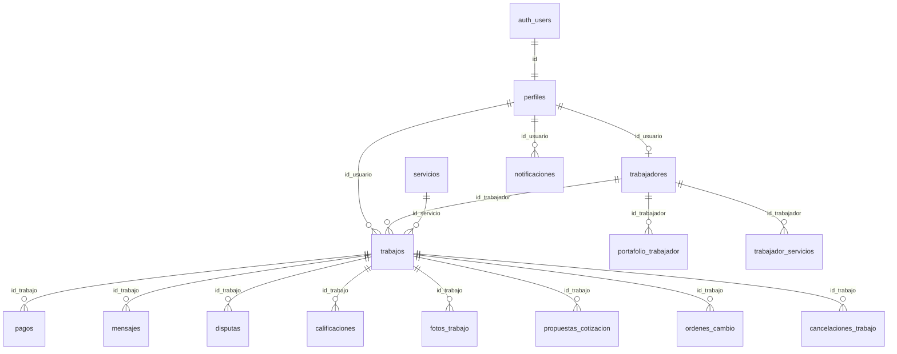

# Diccionario de base de datos — My Works App

| Campo | Valor |
|-------|--------|
| Proyecto | My Works App |
| Base | Supabase `wxqrfcqifkfgawrnqmnj` (PostgreSQL, esquema `public`) |
| Convención | Nombres en español, formato `snake_case` |
| Idioma de este texto | Español neutro |
| Versión | **1.5** — 19 de septiembre de 2026 |
| Estado en el servidor | Rename a español, RLS, catálogo, hardening y las dos correcciones del 19 de septiembre **aplicados** |

Este documento responde dos preguntas: dónde se guarda cada dato y qué significa. Los nombres técnicos se mantienen. Debajo de cada bloque hay una explicación en lenguaje directo, para que cualquier persona del equipo pueda leerlo sin adivinar.

## Cómo se lee

1. La sección 3 es el índice: 28 tablas y para qué sirve cada una.
2. La sección 4 lista los textos exactos que aceptan las columnas de estado. Hay que copiarlos tal cual. Un valor inventado a veces entra en la base y el error aparece después, en la aplicación.
3. La sección 5 explica las tablas que se usan todos los días.
4. La sección 7 explica quién puede leer o cambiar cada cosa. Esa parte ya incluye las funciones corregidas el 19 de septiembre de 2026.

Los identificadores no son todos del mismo tipo. Algunos son `uuid` y otros son `text`. Los sí/no suelen guardarse como número: `1` es sí y `0` es no. Muchas fechas son texto en formato ISO, no un tipo fecha de PostgreSQL. Las políticas de seguridad comparan los identificadores con `::text` para que esa mezcla no falle.

## 1. Para qué sirve

Es el contrato de datos de las tres aplicaciones: móvil (Flutter), web (React) y escritorio (Tauri/React). Si se cambia el nombre de una columna o un estado (`pendiente`, por ejemplo) y no se actualiza este documento y el código, las tres aplicaciones dejan de entenderse.

## 2. Cómo se relacionan los datos

Casi todo empieza en `auth.users`, la cuenta de Supabase. Esa cuenta tiene una ficha en `perfiles`. Si la persona ofrece un oficio, también tiene una fila en `trabajadores`. Cuando un cliente pide un servicio, nace un registro en `trabajos`. De ese registro cuelgan el pago, el chat, las disputas, las fotos y el resto.

El diagrama no dibuja las 28 tablas. Muestra el esqueleto.

Cómo leer una flecha: `perfiles ||--o| trabajadores` significa que un perfil puede tener como máximo un perfil profesional. `trabajos ||--o{ pagos` significa que un trabajo puede tener varios pagos.

## 3. Las 28 tablas

La columna «Nombre anterior» es el nombre en inglés, antes del cambio a español. Sirve si alguien busca `profiles` o `jobs` en un commit viejo.

| # | Tabla | Nombre anterior | Qué guarda |
|---|--------|-----------------|------------|
| 1 | perfiles | profiles | La ficha de la persona en la aplicación |
| 2 | trabajadores | workers | El perfil de quien ofrece un oficio |
| 3 | servicios | services | El catálogo de oficios |
| 4 | trabajos | jobs | La solicitud y su ciclo de vida |
| 5 | pagos | payments | El cobro retenido (simulado, sin pasarela real) |
| 6 | mensajes | messages | El chat de un trabajo |
| 7 | disputas | disputes | Un conflicto entre las partes |
| 8 | notificaciones | notifications | Avisos dentro de la aplicación |
| 9 | calificaciones | ratings | La nota de 1 a 5 |
| 10 | reportes | reports | Una denuncia entre usuarios |
| 11 | propuestas_cotizacion | quote_proposals | Una cotización enviada |
| 12 | ordenes_cambio | change_orders | Un extra o un cambio de alcance |
| 13 | fotos_trabajo | job_photos | Fotos o video del trabajo |
| 14 | portafolio_trabajador | worker_portfolio | La galería del profesional |
| 15 | trabajador_servicios | worker_services | Qué oficios ofrece cada profesional |
| 16 | cancelaciones_trabajo | job_cancellations | Por qué se canceló un trabajo |
| 17 | registros_error_app | app_error_logs | Errores enviados por la aplicación |
| 18 | eventos_abuso | abuse_events | Señales de uso indebido |
| 19 | acciones_pendientes | pending_actions | Acciones hechas sin conexión, pendientes de enviar |
| 20 | bloqueos_usuario | user_blocks | Un usuario bloqueado por otro |
| 21 | consentimientos_usuario | user_consents | Aceptación de términos y protección de datos |
| 22 | banderas_funcionalidad | feature_flags | Interruptores para activar funciones |
| 23 | suscripciones | subscriptions | Planes de pago |
| 24 | impulsos | boosts | Un aumento temporal de visibilidad |
| 25 | eventos_analitica | analytics_events | Eventos de uso del producto |
| 26 | configuraciones_servicio | service_configs | Cómo se arma el formulario de cada oficio |
| 27 | codigos_restablecimiento | password_reset_codes | Códigos para restablecer la contraseña |
| 28 | tickets_soporte | tickets | Un caso de la mesa de ayuda |

Uso diario: de la 1 a la 10 (cuenta, oficio, solicitud, pago y chat). De la 11 a la 16: cotización, evidencia y cancelación. De la 17 a la 28: soporte, cumplimiento y funciones que pueden existir en la base aunque la demostración casi no las use.

## 4. Textos exactos de estado

Estos valores van en columnas `text`. No siempre son un enum rígido de PostgreSQL. Hay que usarlos exactamente así.

| Tema | Valores |
|------|---------|
| Rol | `usuario`, `trabajador`, `administrador`. La función `is_admin()` también acepta `admin`. |
| Estado de la cuenta | `activo`, `suspendido`, `bloqueado`, `eliminado`. También se reconoce `active` en algunas funciones. |
| Estado del trabajo | `pendiente`, `aceptado`, `en_curso`, `completado`, `cancelado`, `expirado`, `no_asistio`, `esperando_pago`, `esperando_cotizaciones`, `cotizacion_seleccionada`, `pausado_orden_cambio`, `esperando_aprobacion_cliente` |
| Estado del pago | `ninguno`, `pendiente`, `autorizado`, `retenido`, `liberado`, `reembolsado` |
| Modalidad de cobro | `legado`, `precio_fijo`, `bloque_horas`, `cotizacion_abierta` |
| Tipo de pago | `principal`, `orden_cambio`, `horas_extra` |
| Disputa | Estado: `abierta`, `en_revision`, `resuelta`. Motivo: `calidad`, `pago`, `conducta`, `otro`. |
| Reporte | `pendiente`, `revisado`, `resuelto`, `descartado` |
| Categoría de oficio | `construccion`, `plomeria`, `electricidad`, `limpieza`, `ensamblaje`, `soporte_tecnico`, `jardinera`, `mudanza`, `general` |
| Modelo de precio | `por_hora`, `fijo`, `por_item` |
| Cotización | `enviada`, `retirada`, `aceptada`, `rechazada` |
| Orden de cambio | `pendiente_cliente`, `aprobada`, `rechazada`, `pagada`, `cancelada` |
| Mensaje | `texto` o `imagen`. Medio: `foto` o `video`. |
| Error de la aplicación | `nuevo`, `reconocido`, `resuelto`, `ignorado` |
| Sincronización sin conexión | `pendiente_sync`, `sincronizando`, `sincronizado`, `fallido` |
| Suscripción | `activa`, `cancelada`, `expirada` |
| Impulso | `visibilidad`, `prioridad`, `destacado` |
| Ticket de soporte | `pendiente`, `resuelto` |

Qué significa cada grupo:

- **Rol.** El cliente es `usuario`. Quien ofrece el oficio es `trabajador`. El escritorio solo deja entrar a `administrador`. Al registrarse, si la persona pide `cliente` se guarda `usuario`. Si pide `especialista`, `specialist` o `worker`, se guarda `trabajador`. El registro público no puede crear un `administrador`.
- **Estado de la cuenta.** Si no está `activo`, la persona no debería operar con normalidad.
- **Estado del trabajo.** Es el recorrido de la solicitud. `pendiente` acaba de crearse. `aceptado` ya tiene profesional. `en_curso` se está ejecutando. `completado` y `cancelado` son finales.
- **Estado del pago.** No hay cobro real a una pasarela. Los estados existen para mostrar el flujo: autorizado, retenido, liberado o reembolsado.
- **Categoría.** Es la clave estable del oficio, por ejemplo `plomeria`. El nombre que ve la persona está en `servicios.nombre`.

## 5. Tablas principales

### 5.1 perfiles

Qué guarda: nombre, correo, rol y si la cuenta se puede usar. El `id` es el mismo que `auth.users.id`. Si no coincide, esa ficha no pertenece a ese inicio de sesión.

| Columna | Tipo | Obligatorio | Qué es |
|---------|------|-------------|--------|
| id | uuid, en general | Sí | Identificador. Igual a `auth.users.id`. |
| nombre | text | Sí | Nombre visible |
| correo | text | Sí | Correo electrónico |
| rol | text | Sí | Ver sección 4 |
| estado_cuenta | text | Sí | Ver sección 4 |
| ruta_foto_perfil | text | No | Dirección de la foto |
| creado_en | text o timestamptz | Sí | Fecha de alta |

Índice: `idx_perfiles_rol`.

Funciones ligadas:

- `handle_new_user` crea la ficha al registrarse. Traduce los alias de rol y nunca asigna administrador en un registro público.
- `protect_profile_sensitive_fields` impide que una persona cambie su propio rol o el estado de la cuenta. Eso solo lo hace un administrador.

Con RLS, cada persona ve y edita su ficha. El administrador puede ver más.

### 5.2 trabajadores

Qué guarda: la ficha profesional. No todo perfil tiene fila aquí. Solo quien ofrece un oficio. La relación es uno a uno con `id_usuario`.

| Columna | Tipo | Qué es |
|---------|------|--------|
| id_usuario | clave, apunta a perfiles | Identificador de la persona |
| profesion | text | Oficio |
| descripcion | text | Presentación |
| calificacion | numeric | Nota promedio |
| disponible | int 0/1 | `1` = puede recibir solicitudes |
| tarifa_visita | numeric | Precio de la visita, en CLP |
| categoria_servicio | text | Oficio principal |
| niveles_precio | json | Paquetes de precio. Es JSON porque cada oficio arma paquetes distintos. |
| servicios_personalizados | json | Servicios extra |
| precios_configurados | int 0/1 | `1` = ya configuró las tarifas |
| zona_trabajo | text | Zona de cobertura |
| conteo_rechazos | int | Cuántas veces rechazó. Se usa para ordenar listados. |

Clave foránea: `trabajadores_id_usuario_fkey`.

El catálogo público puede leer esta tabla sin iniciar sesión (`anon` y `authenticated`). No puede modificarla.

### 5.3 servicios

Qué guarda: el catálogo que ve el cliente (plomería, electricidad y el resto). Si esta tabla está vacía, la pantalla de inicio no tiene oficios que mostrar, aunque existan profesionales.

| Columna | Tipo | Qué es |
|---------|------|--------|
| id | text o uuid | Identificador. El seed usa `svc-plomeria` … `svc-construccion`. |
| nombre | text | Nombre visible |
| descripcion | text | Texto de apoyo |
| categoria | text | Clave estable. Ver sección 4. |
| activo | int 0/1 | `1` = se muestra. `0` = se oculta sin borrar la fila. |
| requiere_certificacion | int 0/1 | Por ejemplo, electricidad |
| modelo_precio | text | `por_hora`, `fijo` o `por_item` |
| aviso_legal | text | Aviso que se muestra al usuario |
| creado_en / actualizado_en | text ISO | Fechas de auditoría |

La migración `06` inserta 8 oficios si falta la categoría. La política pública de lectura no llama a `is_admin()`. Si lo hiciera, una visita sin sesión fallaría con el error `42501`.

### 5.4 trabajos

Qué guarda: la solicitud. Quién la pidió, qué profesional quedó asignado (si ya hay uno), qué oficio, dirección, estado y forma de cobro. Casi toda la aplicación gira alrededor de esta tabla.

Columnas: `id` (a menudo **text**, no asumir uuid), `id_usuario`, `id_trabajador`, `id_servicio`, `estado`, `direccion`, `latitud`, `longitud`, `descripcion`, `fecha_programada`, `metadatos_servicio`, `modalidad_cobro`, `estado_pago`, `id_comuna`, `instantanea_precio`, `id_sku_servicio`, `horas_bloque`, `id_cotizacion_seleccionada`, `creado_en`, `actualizado_en`.

Qué significa lo importante:

- `id_usuario` es el cliente.
- `id_trabajador` es el profesional. Puede estar vacío mientras nadie acepta el trabajo.
- `metadatos_servicio` guarda datos del servicio pactado, incluido un `pin` si el trabajo lo tiene.
- `instantanea_precio` guarda el precio acordado, para no depender solo del catálogo actual.

El cambio de `estado` no se hace con un `UPDATE` directo del cliente. Se hace con la función `transicionar_trabajo`.

### 5.5 pagos

Qué guarda: el cobro ligado a un trabajo. En esta versión no hay pasarela real (no hay Transbank ni Stripe cobrando). La fila y los estados sirven para mostrar el flujo.

Columnas: `id`, `id_trabajo`, `id_orden_cambio`, `tipo_pago`, `monto`, `moneda` (CLP), `estado`, `metodo_pago`, `id_transaccion`, `autorizado_en`, `liberado_en`, `reembolsado_en`, `creado_en`, `actualizado_en`.

El cambio de estado se hace con `simular_transicion_pago`, no con un `UPDATE` directo. Quién puede mover cada estado está en la sección 7.4.

Una consulta con la clave pública y sin sesión no debe devolver pagos. Un 401 o una lista vacía es lo correcto.

### 5.6 a 5.10

| Tabla | Qué guarda | Regla práctica |
|-------|------------|----------------|
| mensajes | `id_trabajo`, `id_remitente`, `id_destinatario`, `contenido`, `tipo`, `ruta_imagen`, `leido`, `creado_en` | El chat es de un trabajo, no una bandeja general. El remitente debe ser la persona que inició sesión. |
| disputas | `id_trabajo`, `abierta_por`, `motivo`, `descripcion`, `estado`, `resolucion`, `resuelta_por`, `resuelta_en` | La abre una de las partes. La cierra un administrador, con la función `admin_actualizar_estado_disputa`. |
| notificaciones | `id_usuario`, `tipo`, `titulo`, `cuerpo`, `id_relacionado`, `leido` | `tipo` todavía puede venir en inglés (por ejemplo `job_accepted`). El resto del esquema ya está en español. |
| calificaciones | `id_trabajo`, `id_usuario`, `puntaje` de 1 a 5, `comentario` | Alimentan la nota promedio del profesional (`trabajadores.calificacion`). |
| reportes | `id_reportante`, `id_usuario_reportado`, `motivo`, `descripcion`, `estado` | Denuncias para moderación. |

## 6. Tablas de apoyo

La migración `05` activa RLS en estas tablas cuando existen.

| Tabla | Para qué se usa |
|-------|-----------------|
| propuestas_cotizacion | Precio enviado en una cotización abierta |
| ordenes_cambio | Un cambio de alcance, con cobro adicional |
| fotos_trabajo | Evidencia del trabajo realizado |
| portafolio_trabajador | Galería del perfil profesional |
| trabajador_servicios | Cruce profesional ↔ oficios (varios oficios por persona) |
| cancelaciones_trabajo | Historial del motivo de cancelación |
| registros_error_app | Errores que envía la aplicación |
| eventos_abuso | Registro de uso indebido, asociado a quien inició sesión |
| acciones_pendientes | Cola de acciones hechas sin conexión |
| bloqueos_usuario | Una persona bloquea a otra |
| consentimientos_usuario | Aceptación de términos y versión del consentimiento |
| banderas_funcionalidad | Activar o apagar una función sin publicar otra versión |
| suscripciones | Plan de la cuenta |
| impulsos | Más visibilidad durante un tiempo |
| eventos_analitica | Uso del producto, para medir |
| configuraciones_servicio | Campos del formulario según el oficio |
| codigos_restablecimiento | Código de restablecimiento de contraseña, además de lo que haga Auth |
| tickets_soporte | Caso de la mesa de ayuda |

## 7. Quién puede ver y cambiar los datos

RLS (Row Level Security) filtra filas dentro de PostgreSQL. Tener la clave pública de Supabase no alcanza para leer todo. Sin RLS, esa clave podría leer de más.

Confirmado en el servidor el 14 de septiembre de 2026: `rowsecurity = true` en `pagos`, `perfiles`, `servicios`, `trabajadores` y `trabajos`. Eso significa que el filtro está activo. No significa que cada política futura sea perfecta.

### 7.1 Funciones de apoyo

| Función | Qué responde |
|---------|----------------|
| `is_admin()` | Sí, si el rol es `admin` o `administrador` y la cuenta está `activo` o `active`. Solo la puede ejecutar quien inició sesión. |
| `es_parte_trabajo(text)` | Sí, si la persona es el cliente de ese trabajo, el profesional asignado o un administrador. El parámetro es `text` porque los identificadores están mezclados. |
| `es_rol_trabajador(text)` | Sí, si esa persona tiene rol de profesional (`trabajador` y alias `worker`, `especialista`, `specialist`) y la cuenta está activa. |

### 7.2 Funciones que cambian datos

El cliente no hace `UPDATE` directo sobre el estado del trabajo ni del pago. Llama a estas funciones. Todas exigen sesión. El rol `anon` no puede ejecutarlas.

| Función | Quién puede usarla | Qué hace |
|---------|--------------------|----------|
| `transicionar_trabajo(id, estado, pin)` | Cliente, profesional asignado o administrador | Cambia el estado solo si la matriz de esa modalidad lo permite. El administrador puede saltarse la matriz. Si el trabajo tiene `pin` en `metadatos_servicio`, pasar a `en_curso` o `completado` exige ese PIN. Omitir el PIN no lo salta. El administrador no necesita PIN. |
| `asignar_trabajador_trabajo(id, id_profesional)` | El propio profesional o un administrador | Acepta un trabajo en `pendiente`, `esperando_pago` o `cotizacion_seleccionada`. El destino tiene que ser un profesional activo. Un cliente no puede asignarse el trabajo a sí mismo. |
| `rechazar_trabajo_pendiente(id, metadatos)` | El profesional ya asignado o un administrador | Cancela un trabajo que sigue en `pendiente`. Si todavía no hay profesional, la función se detiene. Un identificador vacío no autoriza a cualquiera. |
| `simular_transicion_pago(id, estado)` | Ver 7.4 | Mueve el pago simulado. No cobra dinero real. |
| `admin_metricas_resumen()` | Solo administrador | Devuelve un JSON de métricas. |
| `admin_actualizar_estado_disputa(...)` | Solo administrador | Cierra o actualiza una disputa. |
| `registrar_evento_abuso(...)` | La persona que inició sesión | Anota un evento de abuso a su nombre. |

Si se llama una función de administrador sin ser administrador, la base responde un error del tipo «Solo administradores». En HTTP suele verse como 400, no como 404. Un 404 significa que la función no está creada en el servidor.

### 7.3 Matriz del trabajo, en corto

Un trabajo ya `completado`, `cancelado`, `expirado` o `no_asistio` no vuelve atrás.

Se puede pasar a `cancelado` desde casi cualquier estado que no sea final.

El camino normal, según la modalidad:

- Precio fijo o bloque de horas: `esperando_pago` → `aceptado` → `en_curso` → `completado`.
- Cotización abierta: primero se elige cotización y se espera el pago; después el mismo camino.
- Modalidad antigua (`legado`): `pendiente` → `aceptado` → `en_curso` → `completado`. También puede pasar por `esperando_aprobacion_cliente`.

### 7.4 Matriz del pago simulado

Cliente y administrador pueden:

- `pendiente` → `autorizado` o `reembolsado`
- `autorizado` → `retenido`, `liberado` o `reembolsado`
- `retenido` → `liberado` o `reembolsado`

El profesional asignado puede menos:

- Retener (`autorizado` → `retenido`) para congelar el cobro si hay una disputa.
- Liberar solo si el trabajo ya está `completado`.
- Reembolsar solo si el trabajo ya está `cancelado`.

No puede autorizar un pago ni liberarlo mientras el trabajo sigue abierto.

La aplicación hace dos llamadas seguidas, no una sola transacción: primero cambia el trabajo y después mueve el pago. Por eso la liberación mira el estado que el trabajo ya tiene.

### 7.5 Qué ve alguien sin sesión

Puede leer oficios activos (`servicios`) y fichas públicas de profesionales (`trabajadores`). No puede leer pagos, mensajes ni el resto de tablas sensibles. Esa separación está en la migración `06`.

## 8. Qué aplicación usa cada cosa

| Aplicación | Uso |
|------------|-----|
| Móvil (Flutter) | Casi todas las tablas, por repositorios. La versión de publicación exige las claves de Supabase por `--dart-define`. |
| Web (React) | Catálogo, profesionales y reserva. El pago en pantalla es simulado. Solo entra el rol `usuario`. |
| Escritorio (Tauri/React) | Soporte y operación. Métricas y disputas por las funciones de administrador. Solo entra el rol `administrador`. Hay paneles de demostración académica: no son datos de producción. |
| Paquete `shared` | Llamadas compartidas de métricas y disputas para web y escritorio. |

## 9. Lo que todavía no está cerrado

| Tema | Gravedad | Estado |
|------|----------|--------|
| RLS en las tablas principales | Alta | Cerrado. Confirmado el 14 de septiembre de 2026. |
| Catálogo vacío o error `42501` | Alta | Mitigado con la migración `06`. Si el catálogo falla por `is_admin`, hay que volver a aplicar el bloque de políticas de `servicios`. |
| Autorización de las funciones de trabajo y pago | Alta | Cerrado en el servidor el 19 de septiembre de 2026 (`20260919000001` y `20260919000002`). |
| Identificadores `uuid` mezclados con `text` | Media | Documentado. Las funciones comparan con `::text`. |
| Códigos de notificación y de abuso en inglés | Baja | Siguen en inglés. |
| Tabla `service_pricing` | Baja | Hay un modelo en el código y no hay tabla en el rename. |
| Pasarela de pago real | Alta, diferida | No hay cobro real. El flujo es la función de simulación. |
| PIN del servicio | Baja | Si el trabajo guarda un `pin`, las partes que ya pueden leer la fila también pueden verlo. Hoy la aplicación no escribe ese campo. |

## 10. Dónde está el SQL

- `myworksapp_app/supabase/migrations/20260914000004_aplicar_rename_es.sql` — nombres en español
- `20260914000005_rls_politicas_negocio.sql` — RLS y funciones de administrador
- `20260914000006_seed_servicios_marketplace.sql` — 8 oficios y lectura pública del catálogo
- `20260915000001_hardening_seguridad_sin_psp.sql` — primera versión de las funciones de estado y pago
- `20260917000001_auth_role_aliases_cliente_especialista.sql` — alias de rol al registrarse
- `20260919000001_fix_rpc_autorizacion.sql` — cierra rechazo, asignación, pago y PIN
- `20260919000002_pago_al_cerrar_trabajo.sql` — el profesional solo mueve el pago si el trabajo ya está cerrado

Otros textos: [mapa_esquema_en_es.md](mapa_esquema_en_es.md), [APLICAR_MIGRACION_ES.md](APLICAR_MIGRACION_ES.md), [VERIFICACION_BD_REMOTA.md](VERIFICACION_BD_REMOTA.md), [APLICAR_HARDENING_20260915.md](APLICAR_HARDENING_20260915.md).

Versión Word de este mismo documento: `docs/DICCIONARIO_BASE_DATOS.docx`.
